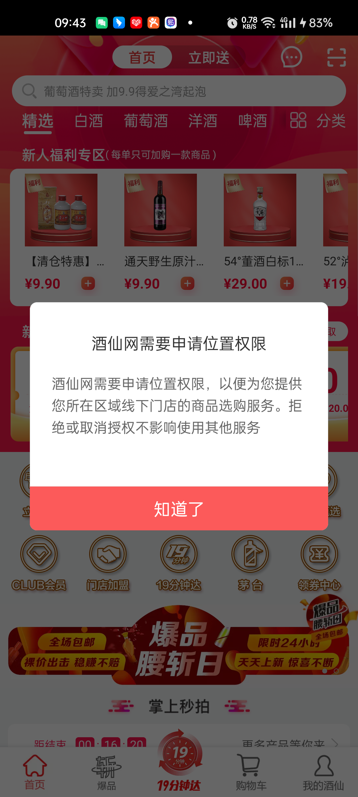
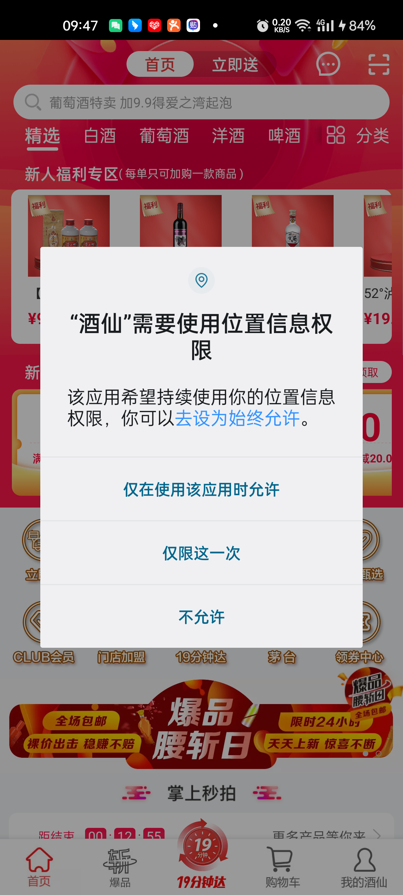

<center><big><b>首次打开app进行功能操作前不得提前弹框申请权限</b></big></center>
------
[TOC]
### 版本
```
9.1.12
```
### 开发分支
```
feature/feature_fyg_9.1.12_首次打开app进行功能操作前不得提前弹框申请权限
```

[]()

### 需求


### a1,

应用审核意见：
您的应用首次运行时，在展示使用权限对应的相关产品或服务之前，提前向用户弹窗申请开启“位置信息”权限，不符合华为应用市场审核标准。
测试步骤：首次打开APP，进行功能操作前，应用弹窗申请开启“位置信息”权限。
修改建议：应用如需申请权限，应在用户使用对应业务功能时申请，不得提前弹窗申请权限，且权限申请行为需与实际使用目的一致。
请参考《审核指南》第7.19相关审核要求：https://developer.huawei.com/consumer/cn/doc/50104
APP常见个人信息保护问题FAQ请参考https://developer.huawei.com/consumer/cn/doc/distribution/app/FAQ-faq#h2-1628489707221-10
测试环境：Wi-Fi联网、HarmonyOS 3.0.0(Mate 50 Pro）、中文环境。


### a2,

您的应用审核未通过。 应用ID：10059455 应用名称：酒仙 应用版本：9.1.11 被拒绝原因：

应用审核意见：

​    1.您的应用被系统检测出存在“无响应”功能问题，不符合华为应用市场审核标准。

测试步骤：点击首页-右上角扫一扫，应用出现无响应情况。

测试环境：Wi-Fi联网、HarmonyOS 2.0.1(nova 9)、中文环境。

修改建议：请参考测试结果进行修改。

请参考《审核指南》第3.1相关审核要求：https://developer.huawei.com/consumer/cn/doc/50104

2.您的应用首次运行时，在展示使用权限对应的相关产品或服务之前，提前向用户弹窗申请开启“位置信息”权限，不符合华为应用市场审核标准。

测试步骤：首次打开APP，进行功能操作前，应用弹窗申请开启“位置信息”权限。

修改建议：应用如需申请权限，应在用户使用对应业务功能时申请，不得提前弹窗申请权限，且权限申请行为需与实际使用目的一致。

请参考《审核指南》第7.19相关审核要求：https://developer.huawei.com/consumer/cn/doc/50104

APP常见个人信息保护问题FAQ请参考https://developer.huawei.com/consumer/cn/doc/distribution/app/FAQ-faq#h2-1628489707221-10

​    测试环境：Wi-Fi联网、HarmonyOS 3.0.0(Mate 50 Pro）、中文环境。

 如有疑问，可直接回复本条通知进行咨询

<video src="首次打开app进行功能操作前不得提前弹框申请权限_task.assets/酒仙.mp4" alt="screen_2023-07-25-09-43-38_MainActivity" style="zoom:30%;" />


### [客服对话](https://developer.huawei.com/consumer/cn/service/josp/agc/index.html#/interactive)







如图我们app启动打开首页的时候会向用户去申请位置权限，并且也是先弹我们自定义的位置权限对话框去告知用户为什么需要位置权限，当用户单击【知道了】按钮后，会去申请位置权限，这个时候如果用户不同意申请权限也是可以单击【不允许】去拒绝的， 我这样的设计也没有违反《审核指南》第7.19 的要求呀 ，为什么审核未通过，请告知我根本原因


[重新申请了](https://developer.huawei.com/consumer/cn/service/josp/agc/index.html#/myApp/10059455/v1202109536362575168)

我没有改代码，我怀疑是他们平台误报，我从新申请审核

​	

### 反馈


尊敬的开发者，您好！您的应用首次运行时，在用户点击使用对应功能服务之前（如：未有任何操作、未点击需要权限的功能等），提前向用户弹窗申请权限。**如《审核指南》第7.19 的要求，应用获取用户权限应遵循最小必要原则，非用户主动触发，均属于不合理场景**。


修改建议：**请在用户实际使用应用内对应功能或服务时，应用再根据功能服务所需向用户弹窗申请对应权限（权限申请行为需与使用目的一致），并征得用户同意。（并非不允许应用获取权限）**


可参考应用市场对外的隐私FAQ第5条相关整改建议及要求：https://developer.huawei.com/consumer/cn/doc/distribution/app/FAQ-faq#h2-1628489707221-10

可参考管局第6点的发文要求：http://c.gb688.cn/bzgk/gb/showGb?type=online&hcno=977D9EBB32ABF0A7DD6A1215969FE57A


### [再次沟通，希望在不改代码的情况下，完成该功能](https://developer.huawei.com/consumer/cn/service/josp/agc/index.html#/interactive)


您好，我们严格按照规定非必要不获取客户信息；但我们的APP进入首页时，需要对用户展示商品，而商品需要根据用户当前的位置，来判断商品是否有货，多久可以配送到，以为用户提供更优质的购买体验，所以我们需要在app启动进入首页时，发起询问要获取客户地理位置；


我刚从android应用市场下载 美团外卖app ,并测试了一下，他们app和我们app的流程一样都是启动进入首页后就会申请位置权限，为什么他们可以通过应用市场审核呢？ 


### [沟通结果](https://developer.huawei.com/consumer/cn/service/josp/agc/index.html#/interactive)


尊敬的开发者，您好！
感谢您的反馈，华为应用市场致力于为用户打造一个安全可靠的应用分发平台，**我们根据监管法规不断完善审核要求，并对在架应用进行巡查复测。**
**对于不符合审核要求的应用，我们均会进行核实处理，要求整改。**请您按照审核结果完善应用，并以最终审核结果为准，
在用户实际使用应用内对应功能或服务时（如：**主动点击使用某功能**），应用再根据功能服务所需向用户弹窗申请对应权限（权限申请行为需与使用目的一致），并征得用户同意。
感谢您对华为应用市场的支持！


### 思路：


### 接口信息
[接口地址]()


```


```
### UI
[UI地址]()

[蓝湖](https://lanhuapp.com/web/#/item/project/stage?pid=ade3e812-abd9-4f88-85f4-8492cf94f2f8&tid=2bfe6305-22be-4657-8002-077892423dbe&see=all)


### 文案


a0,
      切换地址
      fragment_shop_empty


```
<include
    android:id="@+id/layout_empty"
    android:layout_width="match_parent"
    android:layout_height="wrap_content"
    app:layout_constraintTop_toBottomOf="@+id/ll_addresslayout"
    layout="@layout/fragment_shop_empty"
    android:visibility="gone" />
```


```
layout_empty.setVisibility(showEmpty ? View.VISIBLE : View.GONE);
```


```
setLayoutUI(boolean showEmpty)
```


com/jiuxian/client/fragment/B2CShopMainFragment.java:207

```
if (!TextUtils.isEmpty(data.mData.shopId)) {
    mShopId = data.mData.shopId;
    setLayoutUI(false);
    loadData();
} else {
    setLayoutUI(true);

}
```


a2,

立即送

MainFragmentTab.java:140

com/jiuxian/client/fragment/MainFragmentTab.java:239

```


            if (position!=currentPosition){
                currentPosition=position;
                EnableRefresh enableRefresh = (EnableRefresh) mFragmentManager.findFragmentByTag("f" + position);
                if (enableRefresh!=null){
                    enableRefresh.refreshData();
                }
            }
            
```


```
    
        
      
      
      
      
      文案是用来记录开发过程中的字符的，例：
        a0,当期activity，fragment 层次结构(用于快速定位要改的文件)

          B2CShopDetailFragment
              B2CShopListFragment
                    B2CO2OMainShopProductFragment

        a1,需求或UI中的文本描述 例：
          资质认证
          查看资质
          请输入图形验证码
        a2,开发的activity 类名，布局文件名，activity类的全名称androidManifest.xml 布局文件中需要声明该activity标签 例：
          ShopQualificationInfoActivity
          activity_shop_qualification_info_layout
          com.jiuxian.client.ui.ShopQualificationInfoActivity

          ShopQualificationInfoEmptyFragment
          fragment_shop_qualification_info_empty

        a3, 给类，view,图片,方法，bean对象起名字的缓存文本或者其他内容
          ic_upload_qualification
          QualificationInfoResult


          find . -type f -size +1M

```
### 待完成的功能
```


```
### bug改动点
```


ViewPager学习 MainFragmentTab.java:252
ViewPager2.OnPageChangeCallback中首次通过onPageSelected方法切换fragment后
通过 mFragmentManager.findFragmentByTag("f" + position) 获取不到对应的fragment ，因为此时fragemnt还没有添加完成
                mMagicIndicator.post(new Runnable() {
                    @Override
                    public void run() {
                        EnableRefresh enableRefresh = (EnableRefresh) mFragmentManager.findFragmentByTag("f" + position);
                        if (enableRefresh!=null){
                            enableRefresh.refreshData();
                        }
                    }
                });


```
### 参考

  []()
  []()
  []()


  []()


[TOC]


### android9.1.12版本【首次打开app进行功能操作前不得提前弹框申请权限】功能提测


| 提测需求/bug  |   描述          |  开发           |  产品                |       完成      |  编号            |  变更影响范围     |   自测    |  提测分支       |  提测时间         |
| ------------ |      ----      |       ----     |      ----            |      ----      |  ----            |   ------------  |   ----   |  ------       |  --------        |
|  首次打开app进行功能操作前不得提前弹框申请权限   |                |  付玉光       |   周立新    |       ok       | 2023-07-25/09-39-33  |                 |    ok    | feature/feature_preRelease_9.1.12 |  2023-07-28/15:57:40 |

