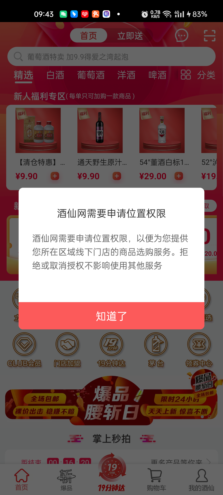
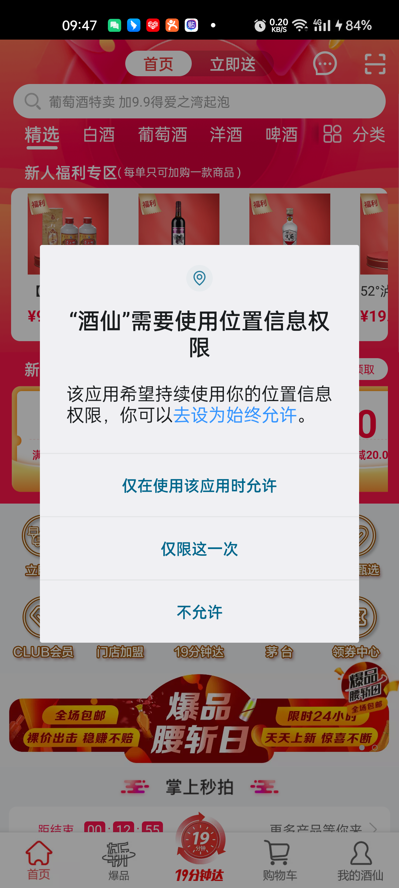

<center><big><b>首次打开app进行功能操作前不得提前弹框申请权限</b></big></center>
------
[TOC]
### 版本
```
9.1.12
```
### 开发分支
```
feature/feature_fyg_9.1.12_首次打开app进行功能操作前不得提前弹框申请权限
```

[]()

### 需求
应用审核意见：
您的应用首次运行时，在展示使用权限对应的相关产品或服务之前，提前向用户弹窗申请开启“位置信息”权限，不符合华为应用市场审核标准.
测试步骤：首次打开APP，进行功能操作前，应用弹窗申请开启“位置信息”权限.
修改建议：应用如需申请权限，应在用户使用对应业务功能时申请，不得提前弹窗申请权限，且权限申请行为需与实际使用目的一致.
请参考《审核指南》第7.19相关审核要求：https://developer.huawei.com/consumer/cn/doc/50104
APP常见个人信息保护问题FAQ请参考https://developer.huawei.com/consumer/cn/doc/distribution/app/FAQ-faq#h2-1628489707221-10
测试环境：Wi-Fi联网、HarmonyOS 3.0.0  Mate 50 Pro.中文环境.


### [客服对话](https://developer.huawei.com/consumer/cn/service/josp/agc/index.html#/interactive)






如图我们app启动打开首页的时候会向用户去申请位置权限，并且也是先弹我们自定义的位置权限对话框去告知用户为什么需要位置权限，当用户单击【知道了】按钮后，会去申请位置权限，这个时候如果用户不同意申请权限也是可以单击【不允许】去拒绝的， 我这样的设计也没有违反《审核指南》第7.19 的要求呀 ，为什么审核未通过，请告知我根本原因


[重新申请了](https://developer.huawei.com/consumer/cn/service/josp/agc/index.html#/myApp/10059455/v1202109536362575168)

我没有改代码，我怀疑是他们平台误报，我从新申请审核
