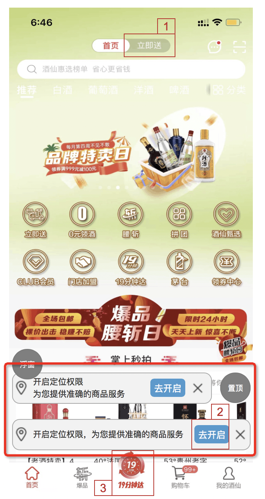
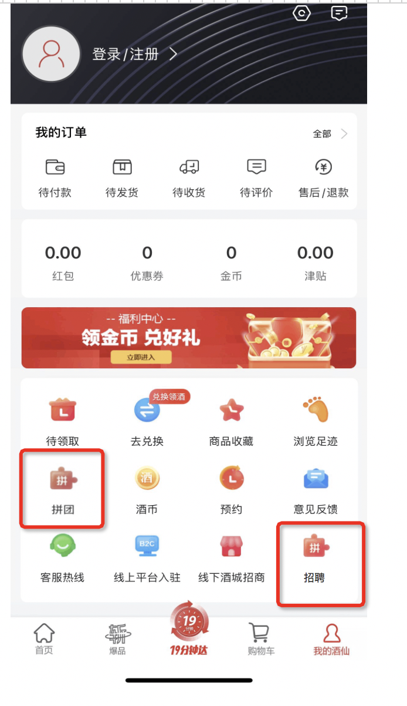

<center><big><b>我的页面增加拼团和招聘关注的主播和金币由服务端控制</b></big></center>
------
[TOC]
### 版本
```
9.1.12
```
### 开发分支
```
feature/feature_fyg_9.1.12_我的页面增加拼团和招聘关注的主播和金币由服务端控制
```

[]()
### 需求


我的页面增加拼团和招聘关注的主播和金币由服务端控制







### 思路：
重点难点\n实现思路\n开发过程中的注意点都可以写这里\n
### 接口信息
[接口地址]()
```

getModuleData

JIN_BI, // 金币
ZHU_BO; // 关注主播
```
### UI
[UI地址]()

### 文案
```
      文案是用来记录开发过程中的字符的，例：
        a0,当期activity，fragment 层次结构(用于快速定位要改的文件)

          B2CShopDetailFragment
              B2CShopListFragment
                    B2CO2OMainShopProductFragment

        a1,需求或UI中的文本描述 例：
          资质认证
          查看资质
          请输入图形验证码
        a2,开发的activity 类名，布局文件名，activity类的全名称androidManifest.xml 布局文件中需要声明该activity标签 例：
          ShopQualificationInfoActivity
          activity_shop_qualification_info_layout
          com.jiuxian.client.ui.ShopQualificationInfoActivity

          ShopQualificationInfoEmptyFragment
          fragment_shop_qualification_info_empty

        a3, 给类，view,图片,方法，bean对象起名字的缓存文本或者其他内容
          ic_upload_qualification
          QualificationInfoResult


          find . -type f -size +1M

```
### 待完成的功能
```


```
### bug改动点

##### a1, 要根据sort 排序，客户端进行了排序，把排序规则去掉，有服务端顺序返回


```


```
### 参考

  []()
  []()
  []()
  []()


[TOC]


### android9.1.12版本【我的页面增加拼团和招聘关注的主播和金币由服务端控制】功能提测


| 提测需求/bug  |   描述          |  开发           |  产品                |       完成      |  编号            |  变更影响范围     |   自测    |  提测分支       |  提测时间         |
| ------------ |      ----      |       ----     |      ----            |      ----      |  ----            |   ------------  |   ----   |  ------       |  --------        |
|  我的页面增加拼团和招聘关注的主播和金币由服务端控制   |                |  付玉光       |   孔宁宁    |       ok       | 2023-07-28/09-47-43  |                 |    ok    | feature/feature_preRelease_9.1.12 | 2023-07-28/10-27-5 |

