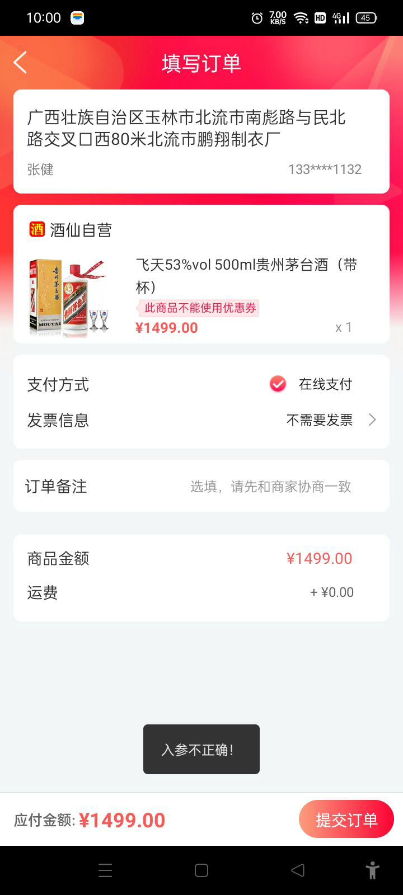
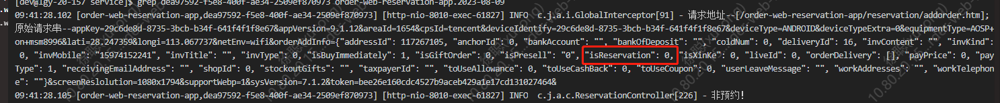
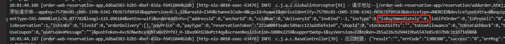

<center><big><b>客服反馈问题_提交订单页_报入参不正确</b></big></center>
------
[TOC]
### 版本
```
9.1.14
```
### 开发分支
```
feature/feature_fyg_9.1.14_客服反馈问题_提交订单页_报入参不正确
```

[]()

### 需求




jxw348742488 顾客表示抢购的时候提示入参不正确，麻烦看下什么情况呢


徐聪:这里参数传的有问题



徐聪:有时间传的是预约有时候不是，

付玉光:应该传1 ？
徐聪:对
徐聪:而且传了1了但是商品id和数量没有




徐聪:你网上翻聊天记录，之前说过这个问题


http://showdoc.9ijx.com/index.php?s=/17&page_id=224

付玉光:8.9.4  加了个这个字段 1 是新客领酒 ,目前只有1 和0 ，0 就是正常商品,以后可能有其他活动是 2 3
徐聪:payType


### 思路：


排查结算和提交订单接口，推测是 结算接口还没返回客户端数据，就单击了提交订单，导致的该问题，

解决方案是：在界面上添加一个 不允许用户取消的 loading


### 接口信息
[接口地址](http://showdoc.9ijx.com/index.php?s=/17&page_id=224)

```


```
### UI
[UI地址]()

### 文案
```
     
```
### 待完成的功能
```


```
### bug改动点
```


```
### 参考

[参考](/Users/fuyuguang/jiuxian_studio/doc/付玉光笔记/酒仙网/技术总结及亮点/charles抓包工具，如何做到在手机中安装一次证书，在所有电脑上都可以抓到包，而不用重新安装客户端证书的？/参考)

  [charles 慢网测试,调用接口慢，测试dialog是否可以关闭](https://blog.csdn.net/lzf_hlh/article/details/115487337)
  [使用Charles做弱网测试入门篇](https://blog.csdn.net/lzf_hlh/article/details/115487337)

  [Android 设置Dialog不允许返回或搜索键消除](https://blog.csdn.net/nowlf_android/article/details/7766044)

  [DialogFragment类本身提供了一个setCancelable替代掉了Dialog的setCancelable ](https://blog.csdn.net/growing_tree/article/details/106618149)


#### 提交信息

```


222b926c8bf3da9d48224dcfc6dffb92be161ca3


a,1:dialog支持cancleable,
a,2:只有设置了dialog的取消事件&成功消费掉了，即可关闭dialog


public class DialogLoading extends BaseDialog 
/** 只有设置了dialog的取消事件&成功消费掉了，即可关闭dialog  */
  if (DialogLoading.this != null && DialogLoading.this.isShowing() && mListener != null && mListener.onDialogClickBack()) {
  	return true;
  }


```


[TOC]


### 酒仙官网app android9.1.14版本【客服反馈问题_提交订单页_报入参不正确】功能提测


| 提测需求/bug  |   描述          |  开发           |  产品                |       完成      |  编号            |  变更影响范围     |   自测    |  提测分支       |  提测时间         |
| ------------ |      ----      |       ----     |      ----            |      ----      |  ----            |   ------------  |   ----   |  ------       |  --------        |
|  客服反馈问题_提交订单页_报入参不正确   | 该bug是用户从商品详情页进提交订单页后app调用结算接口响应数据还没返回给客户端时，用户手动单击返回键把dialog取消，紧接着单击提交按钮导致的，用户截图中显示商品数据是因为结算接口返回后，用户截屏给的假象，掩盖了真实的浮现场景。 |  付玉光       |   徐聪    |       ok       | 2023-08-14/18-03-41  | 提交订单页 |    ok    | feature/feature_preRelease_9.1.14 |  2023-08-14/18:33:37 |

