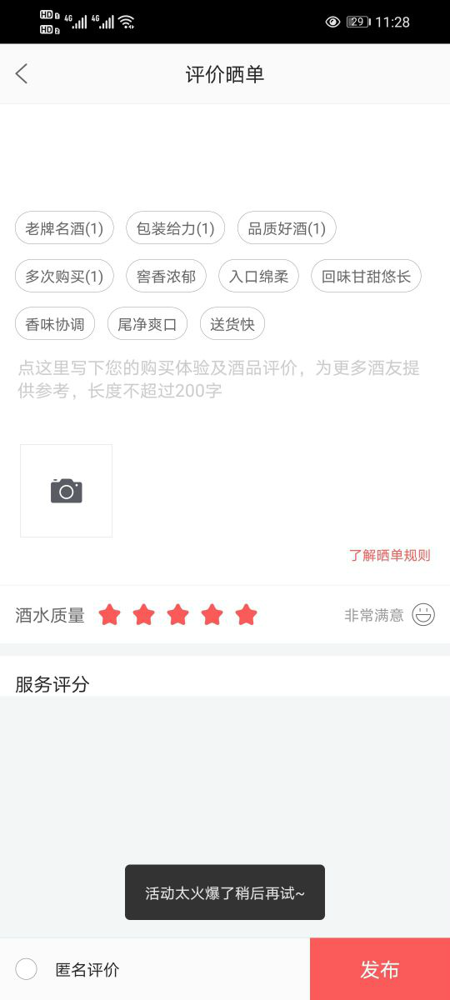

<center><big><b>客服反馈问题_评价晒单页_报活动太火爆了稍后再试</b></big></center>
------
[TOC]
### 版本
```
9.1.14
```
### 开发分支
```
feature/feature_fyg_9.1.14_客服反馈问题_评价晒单页_报活动太火爆了稍后再试
```

[]()

### 需求


 




客户反馈无法发布评价，麻烦帮忙看下呢


```

接口 /product/proDetail.htm  没有返回，或者调用失败导致的，

服务评分布局没出来，也是这个原因导致的！！！


```


### 思路：
重点难点
实现思路
开发过程中的注意点都可以写这里

### 接口信息
[接口地址]()
```


```
### UI
[UI地址]()

### 文案
```
      文案是用来记录开发过程中的字符的，例：
        a0,当期activity，fragment 层次结构(用于快速定位要改的文件)

          B2CShopDetailFragment
              B2CShopListFragment
                    B2CO2OMainShopProductFragment

        a1,需求或UI中的文本描述 例：
          资质认证
          查看资质
          请输入图形验证码
        a2,开发的activity 类名，布局文件名，activity类的全名称androidManifest.xml 布局文件中需要声明该activity标签 例：
          ShopQualificationInfoActivity
          activity_shop_qualification_info_layout
          com.jiuxian.client.ui.ShopQualificationInfoActivity

          ShopQualificationInfoEmptyFragment
          fragment_shop_qualification_info_empty

        a3, 给类，view,图片,方法，bean对象起名字的缓存文本或者其他内容
          ic_upload_qualification
          QualificationInfoResult


          find . -type f -size +1M

```
### 待完成的功能
```


```
### bug改动点
```


```
### 参考

  []()
  []()
  []()
  []()


[TOC]

