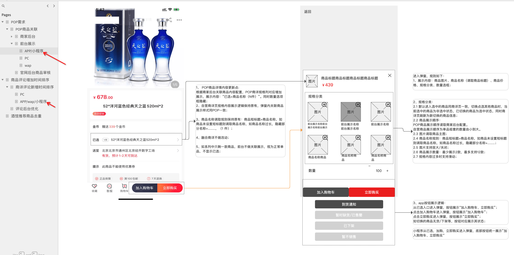
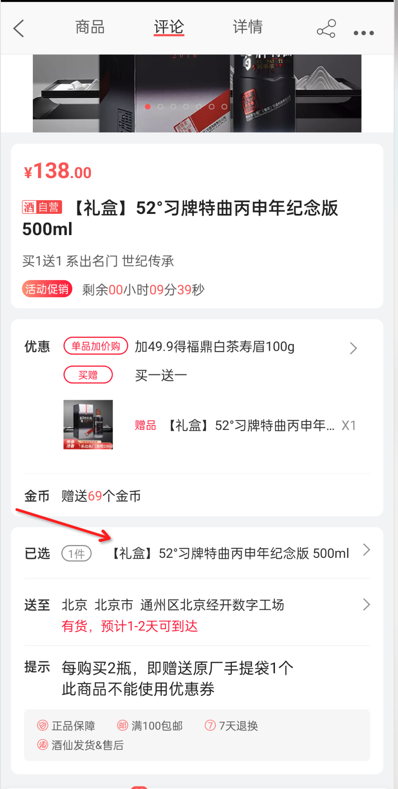
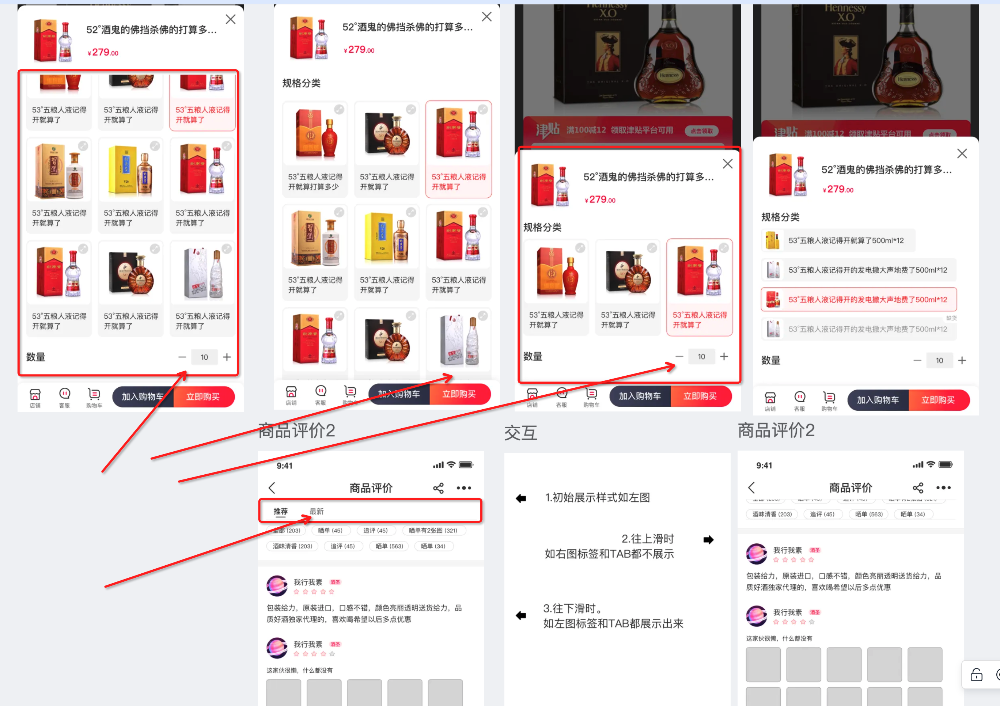
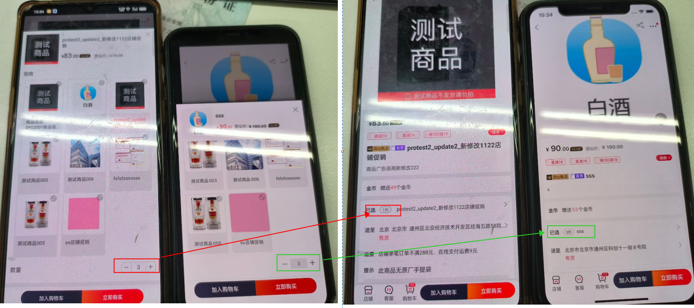
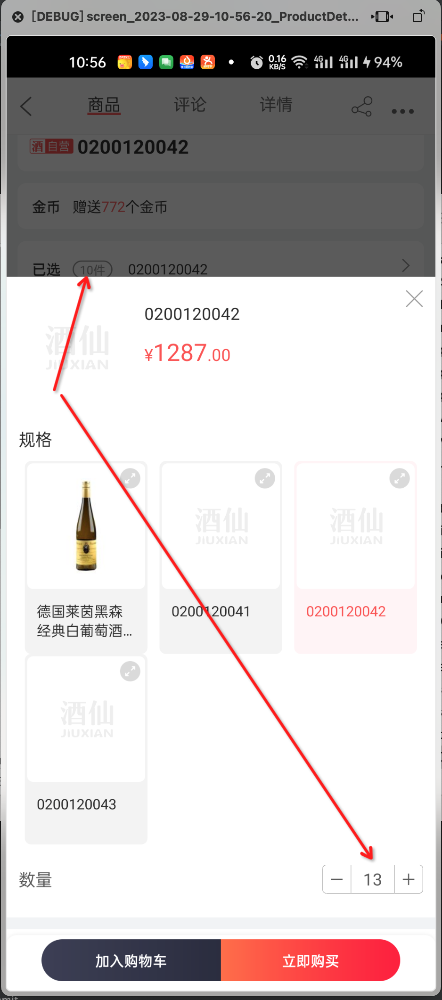
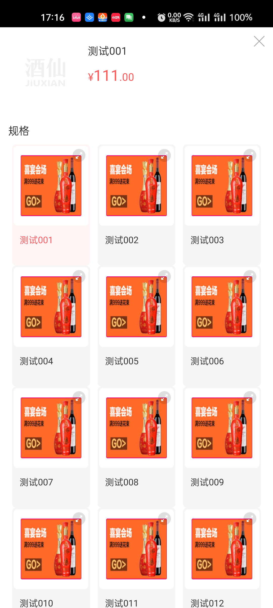
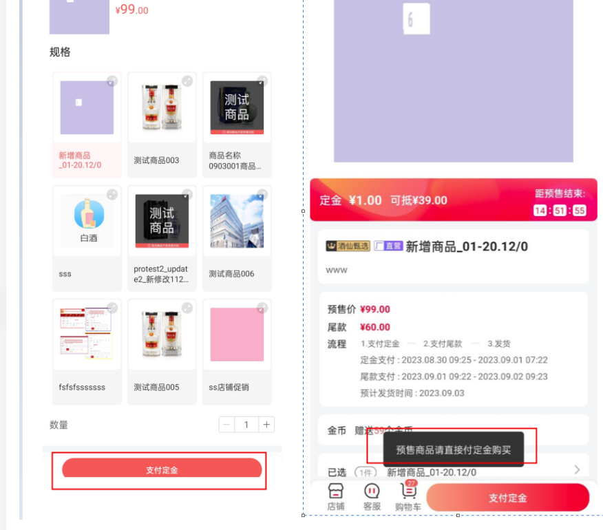
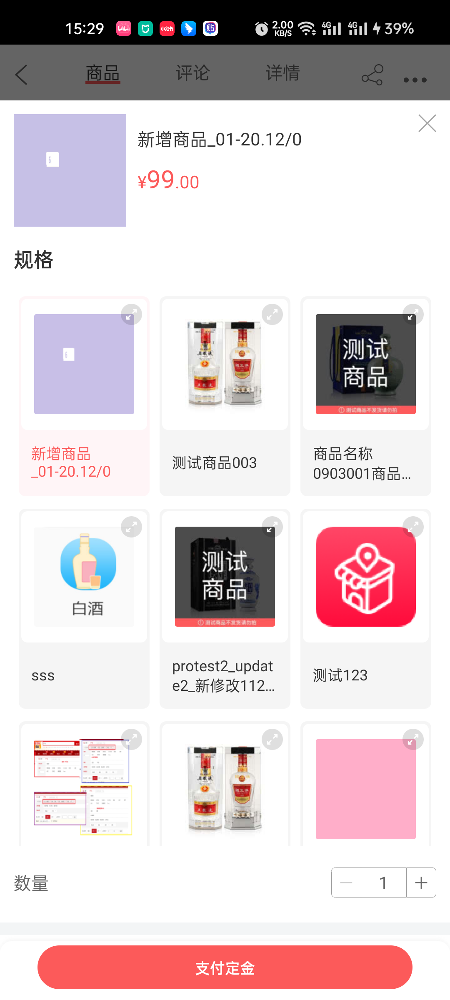

<center><big><b>POP商品详情页关联商品</b></big></center>
------
[TOC]


#### [目录结构](/Users/fuyuguang/Documents/付玉光Notes/酒仙网/酒仙页面/ProductDetailActivity)


### 版本

```
9.1.14
```
### 开发分支
```¡
feature/feature_fyg_9.1.14_POP商品详情页关联商品
```

[]()
### 需求





### 思路：





判断该处返回的集合是否> 1,来判断是否是单品，

```
com/jiuxian/client/fragment/JZKProductFragment.java:1186
mShieldBuy
            case R.id.tv_selected_product_name:
                SwitchProductDialog switchProductDialog = new SwitchProductDialog(mActivity, mProductDetail, mProductNumber, mProductLimitNumber, mPageOzprm);
                switchProductDialog.show();
                break;
        

selectedProductNameTv = mOnePageView.findViewById(R.id.tv_selected_product_name);


<!--已选商品信息layout-->

            <LinearLayout
                android:id="@+id/ll_product_selected_layout"
                android:layout_width="match_parent"
                android:layout_height="wrap_content"
                android:orientation="horizontal"
                android:paddingTop="15dp"
                android:paddingBottom="15dp">

                <TextView
                    android:id="@+id/tv_selected_product_title"
                    style="@style/product_detail_text_style"
                    android:layout_width="wrap_content"
                    android:layout_height="wrap_content"
                    android:text="@string/product_selected_text" />
                    
selectedProductLayout = mOnePageView.findViewById(R.id.ll_product_selected_layout);


```


```java


    private void setNumberAndSelectedLayout() {

        if (mProductDetail.relatedProductsBoList == null || mProductDetail.relatedProductsBoList.size() == 0) {
            selectedProductLayout.setVisibility(View.GONE);
            mNumberControllerLayout.setVisibility(View.VISIBLE);
        } else {
            selectedProductLayout.setVisibility(View.VISIBLE);
            mNumberControllerLayout.setVisibility(View.GONE);
            updateSelectedLayout(mProductNumber, mProductDetail.mProName, true);
        }

    }


com/jiuxian/api/result/ProductDetailResult.java:361
/** 判断当前商品详情页显示的商品有无关联的商品列表  */
    public static boolean hasAssociatedProductList(ProductDetailResult productDetail){
        if (productDetail == null ||
                productDetail.relatedProductsBoList == null ||
                productDetail.relatedProductsBoList.size() == 0) {
            return false;
        } else {
            return true;
        }
    }

```


```
立即购买按钮

<TextView
                        android:id="@+id/product_buy"
                        android:layout_width="0dp"
                        android:layout_height="fill_parent"
                        android:layout_weight="1"
                        android:gravity="center"
                        android:text="@string/product_detail_buy"
                        android:textColor="@color/buy_button_color"
                        android:textSize="12dp"
                        android:textStyle="bold" />


加入购物车按钮

<TextView
                        android:id="@+id/product_put_cart"
                        android:layout_width="0dp"
                        android:layout_height="fill_parent"
                        android:layout_weight="1"
                        android:background="@drawable/product_into_car"
                        android:gravity="center"
                        android:textColor="#ffffff"
                        android:textSize="12dp"
                        android:textStyle="bold"
                        tools:text="adb" />
                        
                        
                        
                        
                        
                        
 com/jiuxian/client/ui/ProductDetailActivity.java:792
 底部按钮的状态，根据mStoreDetail.mCode 来判断
 
 
 


布局中 商品详情页，立即购买按钮始终是显示的，

 com/jiuxian/client/ui/ProductDetailActivity.java:961  中只有两处调用
 mPutBuy.setVisibility(View.VISIBLE);
 1，是
 
 在代码中的  com/jiuxian/client/ui/ProductDetailActivity.java:962
 
 超出配送范围不显示，立即购买，
 
                    if (isCanBuyNow()) {
                        mPutBuy.setEnabled(true);
                        mPutBuy.setVisibility(View.VISIBLE);
                    }
 
 
 2，是
 
 
        if (mShieldBuy) {
            mPutBuy.setVisibility(View.GONE);
            mPutCart.setBackgroundResource(R.drawable.b2c_product_detail_gradient_red);
        } else {
            mPutBuy.setVisibility(View.VISIBLE);
        }
 
 
 这个方法是在 bindView() 中判断传入的 mShieldBuy 字段来判断
 
 
```


重点难点
实现思路
开发过程中的注意点都可以写这里


```

商品详情页：
ProductDetailResult.StoreDetail data
data.mCode 对应说明

		ADD_TO_CART(1, "加入购物车"),
    HAS_BEEN_OFF_THE_SHELF(2, "已下架"),
    TEMPORARILY_NOT_SELL(3, "暂不销售"),
    TEMPORARILY_OUT_OF_STOCK(4, "到货通知"),
    HAS_BEEN_ROBBED_OF_LIGHT(5, "已抢光"),
    TEMPORARILY_NOT_DISTRIBUTION(6, "暂不配送"),
    MIAO_SHA_ADD_TO_CART(7, "立即秒杀"),
    CONTROL_NOT_SUPPORT(8, "不支持购买"),
    PAY_PRESELL_FIRST(9, "支付定金"),
    DOWNLOAD_NEW_VERSION(10, "预售商品请升级APP购买"),
    NOW_RESERVATION(11, "立即预约"),
    BUY_RESERVATION(12, "立即抢购"),
    RESERVATION_DOWNLOAD_NEW_VERSION(13, "请升级APP预约抢购"),
    BUY_YEAR_CLUB(14, "开通club年卡立即参与"),
    GO_TO_APP_RESERVATION(15, "请前往APP预约抢购"),
    JIAGEGUANKONG__BUY(16, "立即抢购"),
    UPDATE_TO_BUY(17, "请升级APP参与抢购"),
    /* 当返回18的时候，客户端要提示升级窗口*/
    UPDATE_VERSION(18, "请升级最新APP购买"),
    DISTANCE_OVER(19,"暂不配送"),
    BUY_IT_NOW(20,"立即购买");
    
```


### 接口信息
[接口地址]()


```


```
### UI
[UI地址](https://lanhuapp.com/web/#/item/project/stage?pid=ade3e812-abd9-4f88-85f4-8492cf94f2f8&tid=2bfe6305-22be-4657-8002-077892423dbe&see=all)


```
AssociatedProductAdapter

```




### 文案

```
      文案是用来记录开发过程中的字符的，例：
        a0,当期activity，fragment 层次结构(用于快速定位要改的文件)

          B2CShopDetailFragment
              B2CShopListFragment
                    B2CO2OMainShopProductFragment

        a1,需求或UI中的文本描述 例：
          资质认证
          查看资质
          请输入图形验证码
        a2,开发的activity 类名，布局文件名，activity类的全名称androidManifest.xml 布局文件中需要声明该activity标签 例：
          ShopQualificationInfoActivity
          activity_shop_qualification_info_layout
          com.jiuxian.client.ui.ShopQualificationInfoActivity

          ShopQualificationInfoEmptyFragment
          fragment_shop_qualification_info_empty

        a3, 给类，view,图片,方法，bean对象起名字的缓存文本或者其他内容
          ic_upload_qualification
          QualificationInfoResult


          find . -type f -size +1M

```
### 待完成的功能
```


```
### bug改动点


##### a,1

##### SwitchProductDialog.java 修改商品数量后 关闭弹窗或加入购物车后 商品详情页显示修改后数量 ，而非数量1




 修改数量后 关闭弹窗/加入购物车后 显示修改后数量   Android 始终显示1件   这个你看下   


[修改bug : SwitchProductDialog.java 修改商品数量后 关闭弹窗或加入购物车后 商品详情页显示修改后数量 ，而非数量1]()

修改bug : SwitchProductDialog.java 修改商品数量后 关闭弹窗或加入购物车后 商品详情页显示修改后数量 ，而非数量1




##### a,2

[弹窗中加入购物车时 也会验证登录状态（未登录的会跳转到登录页面，立即购买要验证登录 加入购物车不需要验证） ]()

修改bug : 未登录用户，加入购物车不需要引导用户去登录页面，直接调用加入购物车接口及可


##### a,3

当关联的商品过多时，页面不能滑动，并且底部按钮显示不出来

优化UI





a,4

```

修复bug:

单击 已选布局   打开SwitchProductDialog.java 对话框，显示两个按钮 加入购物车和立即购买
单击 加入购物车 打开SwitchProductDialog.java 对话框，只显示 加入购物车和立即购买
单击 立即购买   打开SwitchProductDialog.java 对话框，只显示 立即购买

立即购买：使用加入购物车按钮的外观样式进行展示，单击事件还是在 立即购买按钮上，当单击加入购物车按钮时，判断 mButtonState 来确定 执行 【加入购物车按钮】的事件还是【立即购买的事件】

```


a,5



【Android】 关联弹窗中 1.底部按钮显示时被遮挡住了部分；2.预售按钮点击后提示 预售商品请直接付定金购买；  这两个问题你看下





```

https://test70appcart.jiuxian.com/shoppingcart/add.htm
{
	"result": {},
	"errCode": "PRO_IS_PRESELL",
	"success": "-1",
	"errMsg": "预售商品请直接付定金购买"
}


ProductDetailActivity中单击 支付定金走如下逻辑：

case R.id.other_state_btn:


```


### 参考


[android recyclerview高度自适应，并设置最大高度](/Users/fuyuguang/Documents/付玉光Notes/工具库/UI库/RecyclerView/RecyclerView高度自适应并设置最大高度/RecyclerView高度自适应并设置最大高度.md)


### 提交说明

```

RecyclerView  使用 GridLayoutManager  添加分割线

        mRecyclerView.addItemDecoration(new ItemDecoration() {
            int spanCount = 3;
            @Override
            public void getItemOffsets(@NonNull Rect outRect, @NonNull View view, @NonNull RecyclerView parent, @NonNull State state) {
                int  position = parent.getChildAdapterPosition(view);
                int column = position % spanCount;
                int parentWidth = parent.getWidth() - parent.getPaddingLeft() - parent.getPaddingRight();
                int itemWidth = parentWidth / 4;
                int itemWidthInside = Util.dip2px(10);
                int padding = itemWidth - itemWidthInside;
                int space = (parentWidth - 3 * itemWidthInside) / 3;

                switch (column) {
                    case 0 :
                        outRect.left = 0;
                        outRect.right = padding;
                        break;
                    case 1 :
                        outRect.left = space - padding;
                        outRect.right = padding * 2 - space;
                        break;
                    case 2 :
                        outRect.left = space * 2 - padding * 2;
                        outRect.right = padding * 3 - space * 2;
                        break;
                    case 3 :
                        outRect.left = padding;
                        outRect.right = 0;
                        break;
                }
            }
        });


a,1 
RecyclerView  使用 GridLayoutManager  添加分割线


a,2
需要删除原逻辑代码
com.jiuxian.client.widget.dialog.SwitchProductDialog#onTagClick  
com.jiuxian.client.widget.dialog.SwitchProductDialog#mProductTagList


a,3
使用 ASSOCIATED_PRODUCT_V9_1_14(AppEnv.DEBUG , "v9.1.14_associated_product") 添加测试代码


a,4
添加注释               
mPutBuy 立即购买：GONE
mPutCart 加入购物车：GONE
OtherStateBtn：其他情况按钮添加注释，

什么时候显示立即购买按钮，只有一种判断条件：
	mProductDetail.mStoreDetail.mCode == StoreDetail.CODE_BUY   && 
	没有超出配送范围  &&
	模块总开关打开了 立即购买按钮的开关


a,5
弹框优化：单位时间内不允许多次弹框
com.jiuxian.client.fragment.JZKProductFragment#showSwitchProductDialog


a,6
/** 
判断 SwitchProductDialog 是否正在显示， 如果正在显示的话，就根据当前页面立即购买的状态同步更新对话框中更新立即的状态*/
com.jiuxian.client.ui.ProductDetailActivity#updateSwitchProductDialogWithBuyNewButtonState


a,7
关联商品对话框，加入购物车和立即购买复用商品详情页两按钮的事件


a,8
RoundViewDelegate布局支持使用自定义背景，但圆角背景也会丢失，原因是通过 GradientDrawable 渐变Drawable 来实现的，应该使用Drawable的其他子类来实现
com/jiuxian/client/widget/roundview/RoundViewDelegate.java:219


a,9
1，修改 预览按钮内边距 及选中后取消单击事件，及单击事件的复用避免再次创建单击事件，无效图片单击报【该商品关联的图片暂不能预览】
2，修改ui 底部button 上边距为android:layout_marginTop="20dp"
3，v9.1.14 商品ProductDetailResult增加预览图片字段  originImg 详情页关联商品增加原图字段


a,10
1,kotlin中不支持方法参数是可变参数直接赋值的情况，AssociatedProductAdapter.kt  
2，productBuyNew 和 productAddToCart 背景都改用渐变背景 并 测试加入购物车按钮各种状态的显示效果，UI没改，复用之前的UI色值
3，改写RoundViewDelegate2 支持渐变的圆角背景，支持设置水波纹和传统按下显示效果


修复bug:
a,1
弹框中没有考虑到 商品详情页 OtherStateBtn 按钮的显示状态，先判断OtherStateBtn的显示状态和事件
 jiuxian/src/main/java/com/jiuxian/client/ui/ProductDetailActivity.java          |  6 ++++++
 jiuxian/src/main/java/com/jiuxian/client/widget/dialog/SwitchProductDialog.java | 14 +++++++++++++-

当单击SwitchProductDialog 加入购物车按钮时，此时按钮上的文字为【支付定金】，
执行 ProductDetailActivity OtherStateBtn的单击事件,
判断条件： 商品详情activity中 otherStateBtn 如果是显示状态，就执行它的单击事件，否则执行 ProductDetailActivity 加入购物车按钮的事件

a,2 
if (relatedProductsBos.size() >= 9){
	 mRecyclerView.getLayoutParams().height = Util.dip2px(450);
}


```


  []()
  []()
  []()
  []()


[TOC]


### 酒仙官网app android9.1.14版本【POP商品详情页关联商品】功能提测


| 提测需求/bug  |   描述          |  开发           |  产品                |       完成      |  编号            |  变更影响范围     |   自测    |  提测分支       |  提测时间         |
| ------------ |      ----      |       ----     |      ----            |      ----      |  ----            |   ------------  |   ----   |  ------       |  --------        |
|  POP商品详情页关联商品   |                |  付玉光       |   孔宁宁    |       ok       | 2023-08-15/15-02-35  |                 |    ok    | feature/feature_preRelease_9.1.14 |  2023-08-24/09:08:01 |

