<center><big><b>商品详情模块评论页新增时间排序</b></big></center>
------
[TOC]
### 版本
```
9.1.14
```
### 开发分支
```
feature/feature_fyg_9.1.14_商品详情模块评论页新增时间排序
```

[]()

### 需求
需求内容

商品详情模块评论页新增时间排序


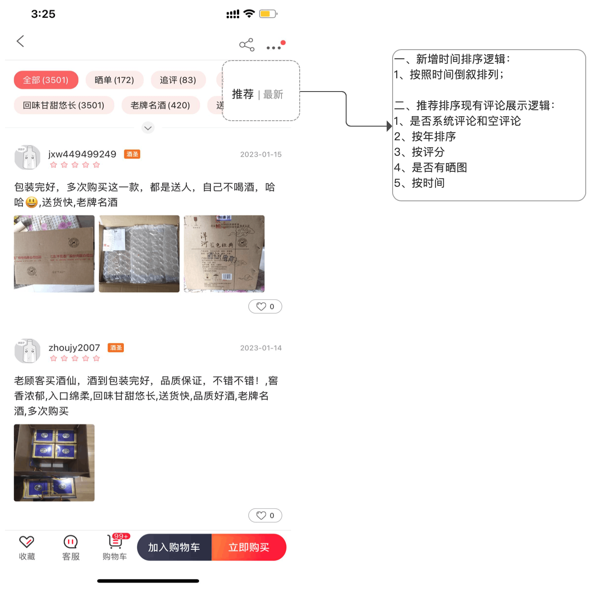


### 思路：
重点难点
实现思路
开发过程中的注意点都可以写这里

### 接口信息
[接口地址]()

```

推荐接口：
https://test70appuser.jiuxian.com/comment/getProductCommentDetail.htm?appKey=e0b359cc-2863-3e35-9c7c-e1fca0d34598&appVersion=9.1.14&areaId=510&channelCode=0&cpsId=jiuxianwebsite&deviceIdentify=e0b359cc-2863-3e35-9c7c-e1fca0d34598&deviceType=ANDROID&deviceTypeExtra=0&equipmentType=PCRM00&labelId=999999999&lati=39.789793&longi=116.564936&netEnv=wifi&pager=1&productId=1448&pushToken=Aq3009FWvIIMzWNuOXX_PQzmtA5qwO1V6VQzMSnoIXEs&screenReslolution=1080x2293&sort=0&supportWebp=1&sysVersion=12


最新接口
https://test70appuser.jiuxian.com/comment/getProductCommentDetail.htm?appKey=e0b359cc-2863-3e35-9c7c-e1fca0d34598&appVersion=9.1.14&areaId=510&channelCode=0&cpsId=jiuxianwebsite&deviceIdentify=e0b359cc-2863-3e35-9c7c-e1fca0d34598&deviceType=ANDROID&deviceTypeExtra=0&equipmentType=PCRM00&labelId=999999999&lati=39.789793&longi=116.564936&netEnv=wifi&pager=2&productId=1448&pushToken=Aq3009FWvIIMzWNuOXX_PQzmtA5qwO1V6VQzMSnoIXEs&screenReslolution=1080x2293&sort=1&supportWebp=1&sysVersion=12


入参增加一个字段  sort  0：默认排序  1 时间排序 


```
### UI
[UI地址](https://lanhuapp.com/web/#/item/project/stage?pid=ade3e812-abd9-4f88-85f4-8492cf94f2f8&tid=2bfe6305-22be-4657-8002-077892423dbe&see=all)


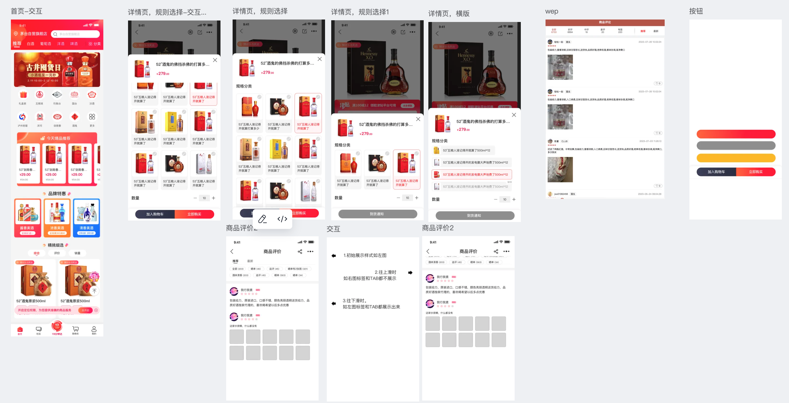


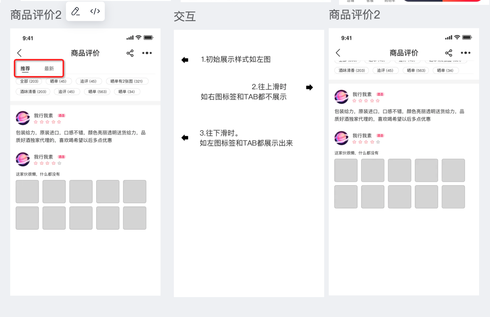


#### UI问题


###### a,1


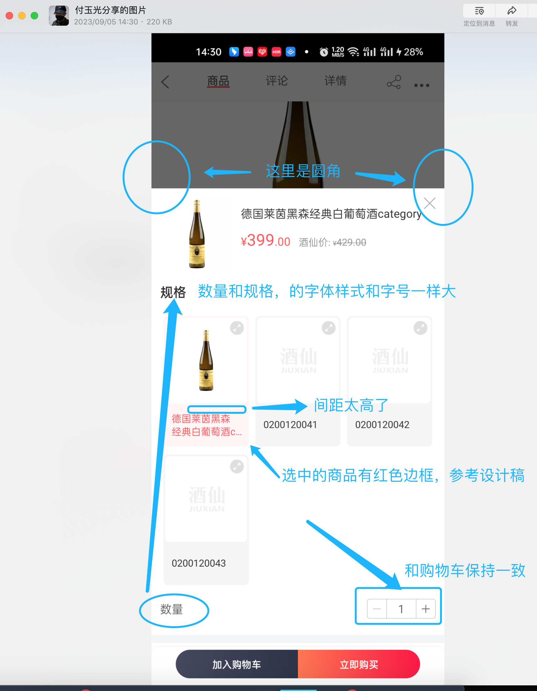


###### a,2


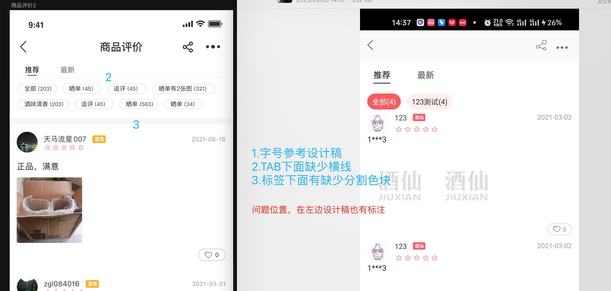


###### a,3


这个标签样式我看万老板改了，你们应该需要同步改吧


就是这个标签,你没有改，万老板改了


###### a,4


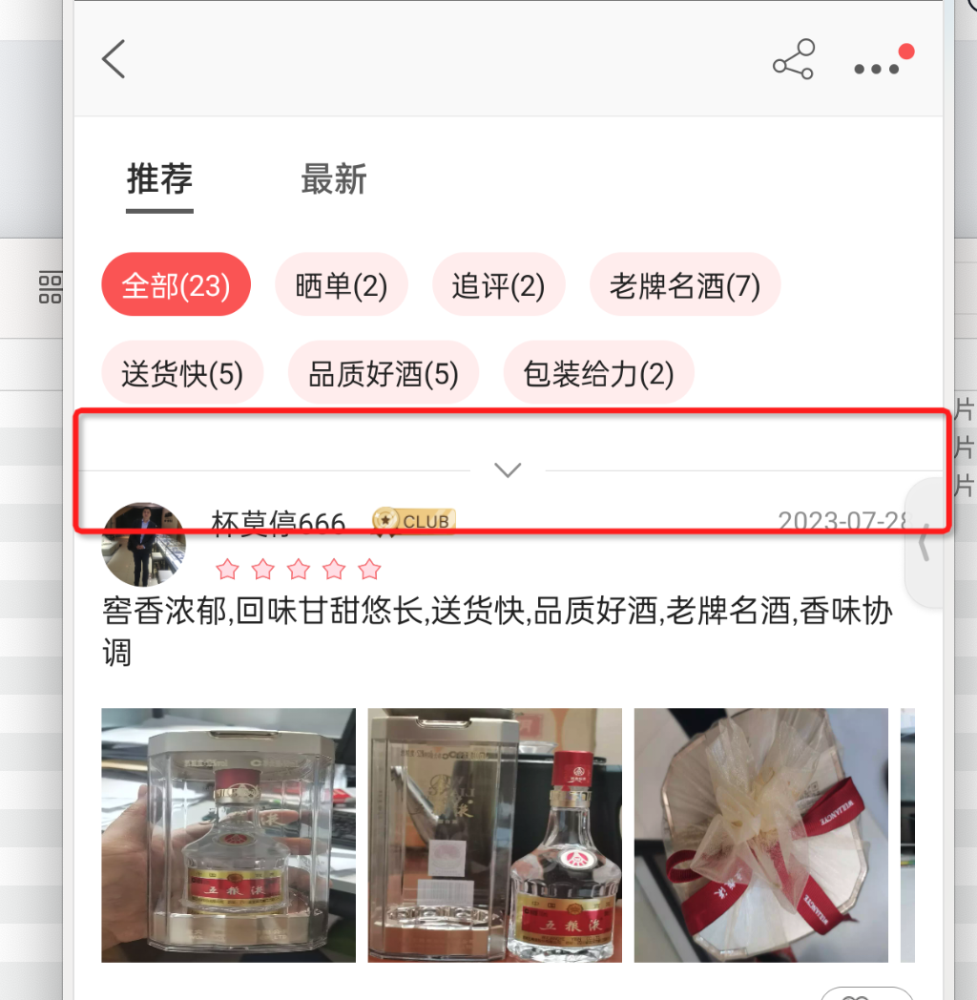


标签多的话，会显示这个,还要加那个 灰色的线吗？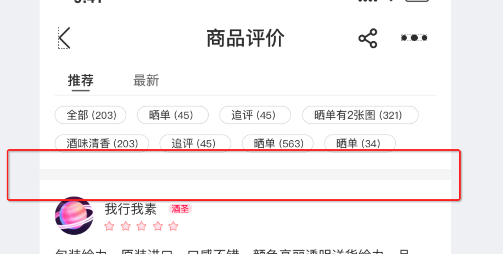


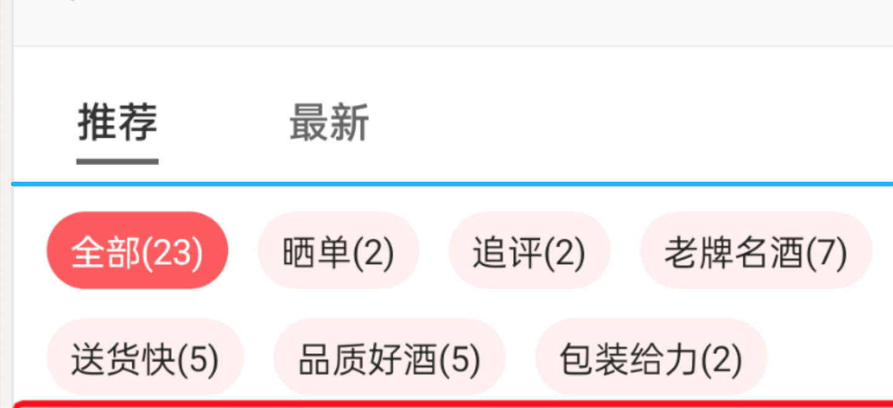


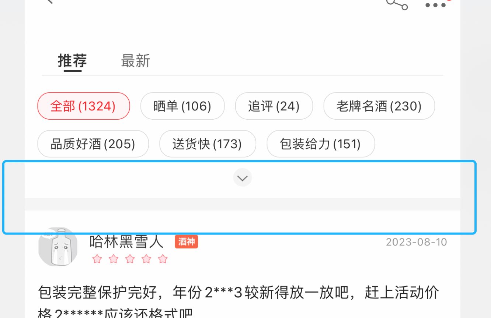


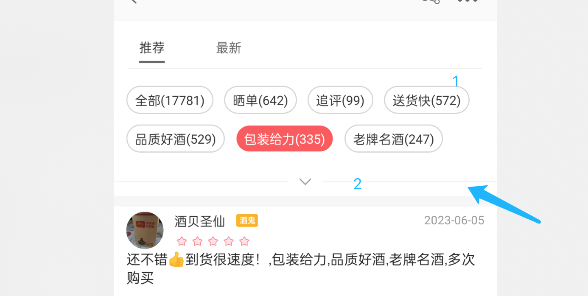


2那个线去掉吧,1的描边颜色深了

###### a,5


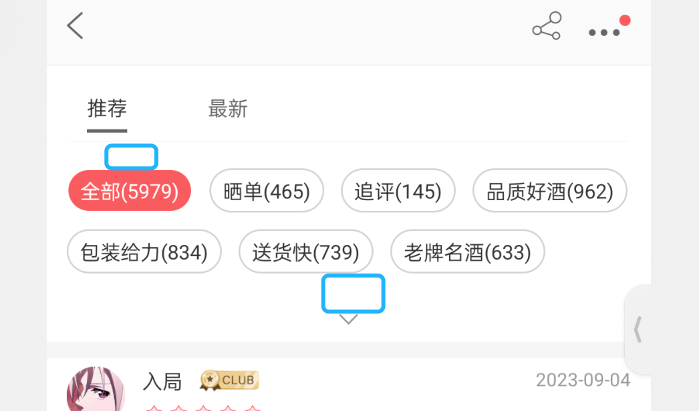

这2个蓝色的距离,都是20px


###### a,6


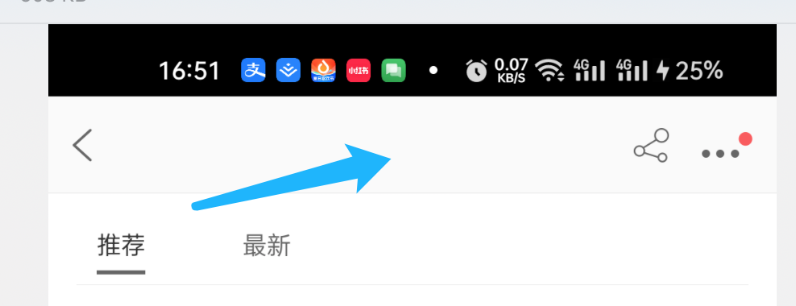

这里缺少标题吧,之前就没有标题呀,加上吧


##### a,7

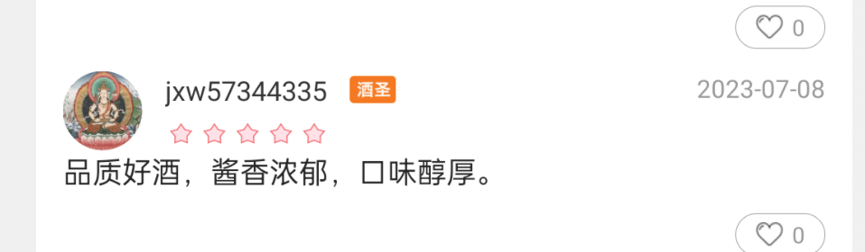

头像和评价内容间距是20px,


###### a,8


**上滑的交互不对,这里不用固定,得改**


### 文案
```
TabLayout


ProductCommentsParentFragment

MainFragmentTab


全部评论
gotoCommentsDetail(ALL_COMMENT)


文案是用来记录开发过程中的字符的，例：
        a0,当期activity，fragment 层次结构(用于快速定位要改的文件)

          B2CShopDetailFragment
              B2CShopListFragment
                    B2CO2OMainShopProductFragment

        a1,需求或UI中的文本描述 例：
          资质认证
          查看资质
          请输入图形验证码
        a2,开发的activity 类名，布局文件名，activity类的全名称androidManifest.xml 布局文件中需要声明该activity标签 例：
          ShopQualificationInfoActivity
          activity_shop_qualification_info_layout
          com.jiuxian.client.ui.ShopQualificationInfoActivity

          ShopQualificationInfoEmptyFragment
          fragment_shop_qualification_info_empty

        a3, 给类，view,图片,方法，bean对象起名字的缓存文本或者其他内容
          ic_upload_qualification
          QualificationInfoResult


          find . -type f -size +1M

```
### 待完成的功能
```


```
### bug改动点
```


```
### 参考

[]()

[tabIndicatorFullWidth](https://www.jianshu.com/p/e94c14c0a8f4)

```


tabIndicatorFullWidth表示Tab指示器的宽度是否满宽度，即与Tab布局一样宽度。
//指示器不与Tab的宽度相同，其宽度由Tab中的文字宽度决定
app:tabIndicatorFullWidth="false"
//指示器与Tab的宽度相同，其宽度由Tab的宽度决定，默认为true
app:tabIndicatorFullWidth="true"


```


#### 提交内容说明


```

commit d509082d8d1331e9148a354cb13bbab39eb74b44 

2023-08-15--15-09-14_付玉光_商品详情模块评论页新增时间排序
feature/feature_fyg_9.1.14_商品详情模块评论页新增时间排序

a,1 
接口ApiCommendTabRequest.java  增加sort字段   
对应界面ProductCommentsParentFragment 中viewpager2的角标index 0 = 推荐，index 1 = 最新
/** v9.1.14 增加一个字段  sort  0：默认排序  1 时间排序   */
private int mSort;


a,2 
新增渐变边框Drawable
Test1Activty
BorderDrawable.java
BorderDrawable2.java

a,3
1，ProductCommentsFragment.java 通过 productCommentsFragment.setArguments(args); 传参sort,并定义成员变量mSort接收
为了方便直接调用 ApiCommendTabRequest 接口，
2，定义mAlwaysCallNetworkInterface字段，只有首次切换tab调用网络接口成功时，才重置为false

a，4  
新增 ProductCommentsParentFragment tab切换使用，包装 ProductCommentsFragment

a,5
ProductDetailActivity.java  
单击 JZKProductFragment中查看全部评论【gotoCommentsDetail(ALL_COMMENT)】 
会发送ProductTab 广播，ProductDetailActivity 中接收该广播并调用changeTab 方法切换viewpager
到第2页，ProductCommentsParentFragment 中接收该广播并切换到 推荐或最新 页


```


  [Android布局中的空格以及占一个汉字宽度的空格，实现不同汉字字数对齐](https://blog.csdn.net/weixin_33748818/article/details/86215091?spm=1001.2101.3001.6661.1&utm_medium=distribute.pc_relevant_t0.none-task-blog-2%7Edefault%7EBlogCommendFromBaidu%7ERate-1-86215091-blog-52411113.235%5Ev38%5Epc_relevant_sort&depth_1-utm_source=distribute.pc_relevant_t0.none-task-blog-2%7Edefault%7EBlogCommendFromBaidu%7ERate-1-86215091-blog-52411113.235%5Ev38%5Epc_relevant_sort&utm_relevant_index=1)

  [Android布局中的空格以及占一个汉字宽度的空格的实现](https://blog.csdn.net/u014651216/article/details/52411113/)

  android:text="&#12288;&#12288;&#12288;商品评价"

  []()
  [ExpandableTextView](https://github.com/Manabu-GT/ExpandableTextView)


[TOC]


### 酒仙官网app android9.1.14版本【商品详情模块评论页新增时间排序】功能提测


| 提测需求/bug  |   描述          |  开发           |  产品                |       完成      |  编号            |  变更影响范围     |   自测    |  提测分支       |  提测时间         |
| ------------ |      ----      |       ----     |      ----            |      ----      |  ----            |   ------------  |   ----   |  ------       |  --------        |
|  商品详情模块评论页新增时间排序   |                |  付玉光       |   孔宁宁    |       ok       | 2023-08-15/15-09-14  |                 |    ok    | feature/feature_preRelease_9.1.14 |  2023-08-24/09:08:53 |


#### 完成后UI


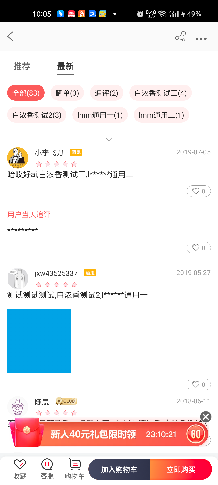


### 页面结构


```

    ProductCommentsFragment{c85b5c5} (8326201e-aa7a-4846-a754-7ea20f2b4bc7 tag=f0)
    JZKProductFragment{c8b4ee6} (13b21771-a5a6-4bc5-9c1f-6662fd2af4b9 id=0x7f09162f)
    SupportRequestManagerFragment{52d7372} (30a65dd0-722d-4233-af6c-fe5c61d49fdd tag=com.bumptech.glide.manager){parent=null}
    ProductCommentsParentFragment{f987f79} (35d27ce9-e5d8-42f2-9dc2-2f71582c4ab6 id=0x7f09162f)
    ProductCommentsFragment{988246c} (414f2337-05fb-40e3-ba33-81127d688a1d tag=f1)


```


