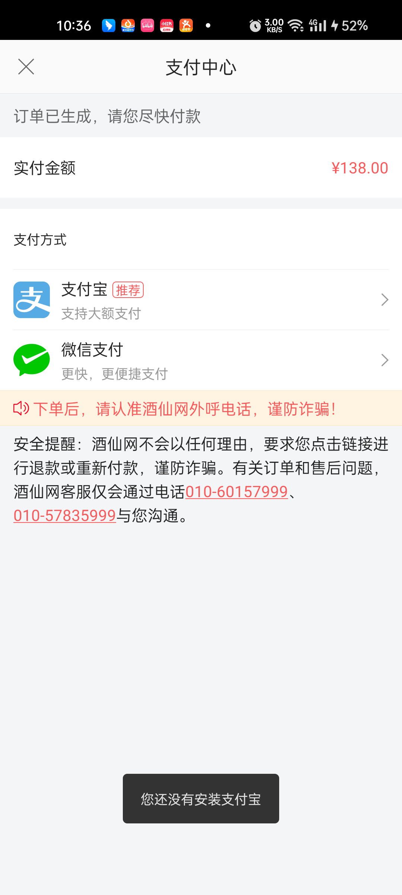

<center><big><b>没有安装支付宝禁止使用支付宝网页支付</b></big></center>
------
[TOC]
### 版本
```
9.1.14
```
### 开发分支
```
feature/feature_fyg_9.1.14_没有安装支付宝禁止使用支付宝网页支付
```

[]()
### 需求
没有安装支付宝禁止使用支付宝网页支付
### 思路：


[判断Android设备上是否安装了某款应用的实现方法](https://www.python100.com/html/70440.html)


如果没有安装支付宝就toast提示：

您还没有安装支付宝


### 接口信息
[接口地址]()
```


```
### UI
[UI地址](/Users/fuyuguang/Documents/付玉光Notes/酒仙网/酒仙页面/PaymentCenterActivity/)





### 文案
```
      文案是用来记录开发过程中的字符的，例：
        a0,当期activity，fragment 层次结构(用于快速定位要改的文件)

          B2CShopDetailFragment
              B2CShopListFragment
                    B2CO2OMainShopProductFragment

        a1,需求或UI中的文本描述 例：
          资质认证
          查看资质
          请输入图形验证码
        a2,开发的activity 类名，布局文件名，activity类的全名称androidManifest.xml 布局文件中需要声明该activity标签 例：
          ShopQualificationInfoActivity
          activity_shop_qualification_info_layout
          com.jiuxian.client.ui.ShopQualificationInfoActivity

          ShopQualificationInfoEmptyFragment
          fragment_shop_qualification_info_empty

        a3, 给类，view,图片,方法，bean对象起名字的缓存文本或者其他内容
          ic_upload_qualification
          QualificationInfoResult


          find . -type f -size +1M

```
### 待完成的功能
```


```
### bug改动点
```


    /**
     *
     * @param context
     * @param packageName
     * @return
     */
    public static  boolean isAppInstalledByPackageInstaller(Context context, String packageName) {
        List<PackageInfo> packages = context.getPackageManager().getInstalledPackages(0);
        for (PackageInfo packageInfo : packages) {
            if (packageInfo.packageName.equals(packageName)) {
                return true;
            }
        }
        return false;
    }


```
### 参考
### 提交id
```

```
### 提交说明
```


```

  []()
  []()
  []()
  []()


[TOC]


### 酒仙官网app android9.1.14版本【没有安装支付宝禁止使用支付宝网页支付】功能提测


| 提测需求/bug  |   描述          |  开发           |  产品                |       完成      |  编号            |  变更影响范围     |   自测    |  提测分支       |  提测时间         |
| ------------ |      ----      |       ----     |      ----            |      ----      |  ----            |   ------------  |   ----   |  ------       |  --------        |
|  没有安装支付宝禁止使用支付宝网页支付   |                |  付玉光       |   周立新    |       ok       | 2023-08-24/10-12-31  |                 |    ok    | feature/feature_preRelease_9.1.14 |  2023-08-24/10:35:07 |

