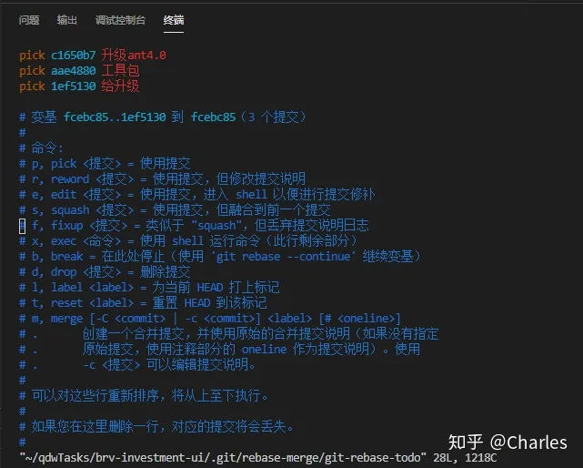

<big><b> 商品详情_查看某商品的评价列表_推荐和最新tab跟随页面滑动而非固定 </b></big>

------

| 提测需求/bug  |   描述          |  开发           |  产品                |       完成      |  编号            |  变更影响范围     |   自测    |  提测分支       |  提测时间         |
| ------------ |      ----      |       ----     |      ----            |      ----      |  ----            |   ------------  |   ----   |  ------       |  --------        |
|  商品详情_查看某商品的评价列表_推荐和最新tab跟随页面滑动而非固定   |                |  付玉光       |   孔宁宁    |       ok       | 2023-09-08/19-09-02  |                 |    ok    | feature/feature_preRelease_9.1.16 |  2023-09-11/18:52:30 |

<table border="1" width="50%" height="50%" cellspacing="0"
  cellpadding="0">
  	<tr>
  		<td rowspan="7" align="left">9.1.14版本</td>
  		<td>提测需求/bug</td>
  		<td>描述</td>
  		<td rowspan="1">开发</td>
  		<td>产品</td>
  		<td>完成</td>
      <td>编号</td>
  	  <td>变更影响范围</td>
  	  <td>自测</td>
     	<td>提测分支</td>
      <td>提测时间</td>
  	</tr>
    <tr>
  		<td rowspan="1" align="left"></td>
  		<td></td>
  		<td></td>
  		<td rowspan="1"></td>
  		<td></td>
  		<td></td>
      <td></td>
  	  <td></td>
  	  <td></td>
     	<td></td>
  	</tr>
    <tr>
  		<td rowspan="1" align="left"></td>
  		<td></td>
  		<td rowspan="1"></td>
  		<td></td>
  		<td></td>
      <td></td>
  	  <td></td>
  	  <td></td>
     	<td></td>
      <td></td>
  	</tr>
    <tr>
  		<td rowspan="1" align="left"></td>
  		<td></td>
  		<td rowspan="1"></td>
  		<td></td>
  		<td></td>
      <td></td>
  	  <td></td>
  	  <td></td>
     	<td></td>
      <td></td>
  	</tr>
    <tr>
  		<td rowspan="1" align="left"></td>
  		<td></td>
  		<td rowspan="1"></td>
  		<td></td>
  		<td></td>
      <td></td>
  	  <td></td>
  	  <td></td>
     	<td></td>
      <td></td>
  	</tr>
    <tr>
  		<td rowspan="1" align="left"></td>
  		<td></td>
  		<td rowspan="1"></td>
  		<td></td>
  		<td></td>
      <td></td>
  	  <td></td>
  	  <td></td>
     	<td></td>
      <td></td>
  	</tr>
  </table>

<table border="1" width="50%" height="50%" cellspacing="0"
  cellpadding="0">
  	<tr>
  		<td rowspan="6" align="left">9.1.14版本</td>
  		<td>提测需求/bug</td>
  		<td>描述</td>
  		<td rowspan="1">开发</td>
  		<td>产品</td>
  		<td>完成</td>
      <td>编号</td>
  	  <td>变更影响范围</td>
  	  <td>自测</td>
     	<td>提测分支</td>
      <td>提测时间</td>
  	</tr>
    <tr>
  		<td rowspan="1" align="left"></td>
  		<td></td>
  		<td></td>
  		<td rowspan="1"></td>
  		<td></td>
  		<td></td>
      <td></td>
  	  <td></td>
  	  <td></td>
     	<td></td>
  	</tr>
    <tr>
  		<td rowspan="1" align="left"></td>
  		<td></td>
  		<td rowspan="1"></td>
  		<td></td>
  		<td></td>
      <td></td>
  	  <td></td>
  	  <td></td>
     	<td></td>
      <td></td>
  	</tr>
    <tr>
  		<td rowspan="1" align="left"></td>
  		<td></td>
  		<td rowspan="1"></td>
  		<td></td>
  		<td></td>
      <td></td>
  	  <td></td>
  	  <td></td>
     	<td></td>
      <td></td>
  	</tr>
    <tr>
  		<td rowspan="1" align="left"></td>
  		<td></td>
  		<td rowspan="1"></td>
  		<td></td>
  		<td></td>
      <td></td>
  	  <td></td>
  	  <td></td>
     	<td></td>
      <td></td>
  	</tr>
    <tr>
  		<td rowspan="1" align="left"></td>
  		<td></td>
  		<td rowspan="1"></td>
  		<td></td>
  		<td></td>
      <td></td>
  	  <td></td>
  	  <td></td>
     	<td></td>
      <td></td>
  	</tr>
  </table>

鼓励经常性的提交，这样可以更快的分享实现的功能，并且减少代码丢失的风险sdfdsfsfdsfdsafdsafsdfsd

<table border="1" width="50%" height="50%" cellspacing="0"
  cellpadding="0">
  	<tr>
  	  <td rowspan="6" align="left">9.1.14版本</td>
  	  <td>提测需求/bug</td>
  	  <td>描述</td>
  	  <td rowspan="1">开发</td>
  	  <td>产品</td>
  	  <td>完成</td>
      <td>编号</td>
  	  <td>变更影响范围</td>
  	  <td>自测</td>
      <td>提测分支</td>
      <td>提测时间</td>
  	</tr>
    <tr>
  		<td rowspan="1" align="left"></td>
  		<td>鼓励经常性的提交，这样可以更快的分享实现的功能，并且减少代码丢失的风险sdfdsfsfdsfdsafdsafsdfsd</td>
  		<td>鼓励经常性的提交，这样可以更快的分享实现的功能，并且减少代码丢失的风险sdfdsfsfdsfdsafdsafsdfsd</td>
  		<td rowspan="1"></td>
  		<td></td>
  		<td></td>
      <td></td>
  	  <td>鼓励经常性的提交，这样可以更快的分享实现的功能，并且减少代码丢失的风险sdfdsfsfdsfdsafdsafsdfsd</td>
  	  <td></td>
     	<td></td>
  	</tr>
    <tr>
  		<td rowspan="1" align="left"></td>
  		<td></td>
  		<td rowspan="1"></td>
  		<td></td>
  		<td></td>
      <td></td>
  	  <td>鼓励经常性的提交，这样可以更快的分享实现的功能，并且减少代码丢失的风险sdfdsfsfdsfdsafdsafsdfsd</td>
  	  <td></td>
     	<td></td>
      <td>鼓励经常性的提交，这样可以更快的分享实现的功能，并且减少代码丢失的风险sdfdsfsfdsfdsafdsafsdfsd</td>
  	</tr>
    <tr>
  		<td rowspan="1" align="left"></td>
  		<td></td>
  		<td rowspan="1"></td>
  		<td>鼓励经常性的提交，这样可以更快的分享实现的功能，并且减少代码丢失的风险sdfdsfsfdsfdsafdsafsdfsd</td>
  		<td></td>
      <td></td>
  	  <td></td>
  	  <td></td>
     	<td></td>
      <td></td>
  	</tr>
    <tr>
  		<td rowspan="1" align="left"></td>
  		<td></td>
  		<td rowspan="1"></td>
  		<td>鼓励经常性的提交，这样可以更快的分享实现的功能，并且减少代码丢失的风险sdfdsfsfdsfdsafdsafsdfsd</td>
  		<td></td>
      <td></td>
  	  <td></td>
  	  <td>鼓励经常性的提交，这样可以更快的分享实现的功能，并且减少代码丢失的风险sdfdsfsfdsfdsafdsafsdfsd</td>
     	<td></td>
      <td></td>
  	</tr>
    <tr>
  		<td rowspan="1" align="left"></td>
  		<td></td>
  		<td rowspan="1"></td>
  		<td></td>
  		<td>鼓励经常性的提交，这样可以更快的分享实现的功能，并且减少代码丢失的风险sdfdsfsfdsfdsafdsafsdfsd</td>
      <td></td>
  	  <td></td>
  	  <td></td>
     	<td>鼓励经常性的提交，这样可以更快的分享实现的功能，并且减少代码丢失的风险sdfdsfsfdsfdsafdsafsdfsd</td>
      <td></td>
  	</tr>
  </table>

