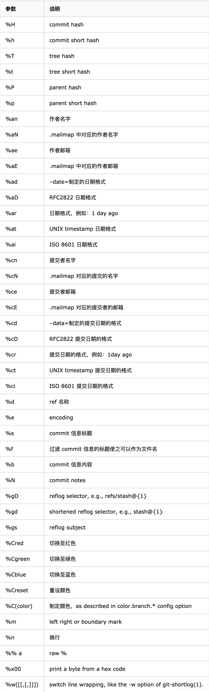

<center><big><b> 自定义git日志输出增加提交说明的正文 </b></big></center>


------


[TOC]


#### [页面结构及图片地址]()


```
(用于快速定位要改的文件)，用别名的方式，直接定位并复制到该处

```


### 需求


### 思路：
请认真核对需求每个界面，及其中的文字描述、并充分理解需求后在开发!


**Change log 工具的使用** 


%s: commit信息标题

%b: commit信息内容

%n: 换行

%%: a raw %


[【Git】Git 统计常用命令](https://blog.csdn.net/DovSnier/article/details/103955982)

[git-show  - 显示各种类型的对象](https://m.php.cn/manual/view/35069.html)





```

 
%H: commit hash
%h: 缩短的commit hash
%T: tree hash
%t: 缩短的 tree hash
%P: parent hashes
%p: 缩短的 parent hashes
%an: 作者名字
%aN: mailmap的作者名字 (.mailmap对应，详情参照[git-shortlog(1)](http://linux.die.net/man/1/git-shortlog)或者[git-blame(1)](http://linux.die.net/man/1/git-blame))
%ae: 作者邮箱
%aE: 作者邮箱 (.mailmap对应，详情参照[git-shortlog(1)](http://linux.die.net/man/1/git-shortlog)或者[git-blame(1)](http://linux.die.net/man/1/git-blame))
%ad: 日期 (--date= 制定的格式)
%aD: 日期, RFC2822格式
%ar: 日期, 相对格式(1 day ago)
%at: 日期, UNIX timestamp
%ai: 日期, ISO 8601 格式
%cn: 提交者名字
%cN: 提交者名字 (.mailmap对应，详情参照[git-shortlog(1)](http://linux.die.net/man/1/git-shortlog)或者[git-blame(1)](http://linux.die.net/man/1/git-blame))
%ce: 提交者 email
%cE: 提交者 email (.mailmap对应，详情参照[git-shortlog(1)](http://linux.die.net/man/1/git-shortlog)或者[git-blame(1)](http://linux.die.net/man/1/git-blame))
%cd: 提交日期 (--date= 制定的格式)
%cD: 提交日期, RFC2822格式
%cr: 提交日期, 相对格式(1 day ago)
%ct: 提交日期, UNIX timestamp
%ci: 提交日期, ISO 8601 格式
%d: ref名称
%e: encoding
%s: commit信息标题
%f: sanitized subject line, suitable for a filename
%b: commit信息内容
%N: commit notes
%gD: reflog selector, e.g., refs/stash@{1}
%gd: shortened reflog selector, e.g., stash@{1}
%gs: reflog subject
%Cred: 切换到红色
%Cgreen: 切换到绿色
%Cblue: 切换到蓝色
%Creset: 重设颜色
%C(...): 制定颜色, as described in color.branch.* config option
%m: left, right or boundary mark
%n: 换行
%%: a raw %
%x00: print a byte from a hex code
%w([[,[,]]]): switch line wrapping, like the -w option of git-shortlog(1).

```


### 接口信息


[接口地址]()


```


```


### UI


[UI地址]()


请认真核对UI每个界面，及其中的文字描述、控件样式特效等。
具体包括每个控件的文字大小，背景颜色及形状，是否加粗，等变化。

【实现开发中需要截图app中的该页面和UI图作对比，找差异】


###### a,1
###### a,2
###### a,3
###### a,4
###### a,5
###### a,6
###### a,7
###### a,8
###### a,


### 文案


```


```


需求或UI中的文本描述 例：
```


```


开发的activity 类名，布局文件名，布局id,属性等，涉及到多个文件的改动，就复制一份出来
```
a1, 类名
打开当前页面的activity或fragment后 按快捷键  【shift+Alt+Command+c】或【shift+Command+c】 复制类名


a2,布局名
打开当前页面的activity或fragment后 按快捷键  【Ctrl+Command+UP】显示和当前界面关联的布局 或android 清单文件
    选中要变更的布局后 按快捷键复制布局名到此处

a3,该布局变更的id或属性


a4,该布局变更的文章描述
      从UI图中获取


a5,新增类、view布局、图片、方法、bean对象起名的记录


```


### 待完成的功能


```


```


### bug改动点


##### a,1
[]()


##### a,2
[]()


##### a,3
[]()


### 提交说明

```

2023-09-19--19-16-35_付玉光_自定义git日志输出增加提交说明的正文
feature_fyg_9.1.16_自定义git日志输出增加提交说明的正文

写上日期
分支名
提交说明，提交以一个小功能或完整的功能为一个单位进行commit,不然提交记录会变的杂乱无章，不好回顾历史及归档，经量以rebase的方式合并

a,1
a,2
a,3
a,4
a,5
a,6
a,7
a,8
a,9

```


### 知识网，此处只是知识体系的引用目录路径，具体还需要你建立知识体系目录 通过命令 别名mcm或mcs
[]()
[]()
[]()
[]()

```


```


[TOC]

