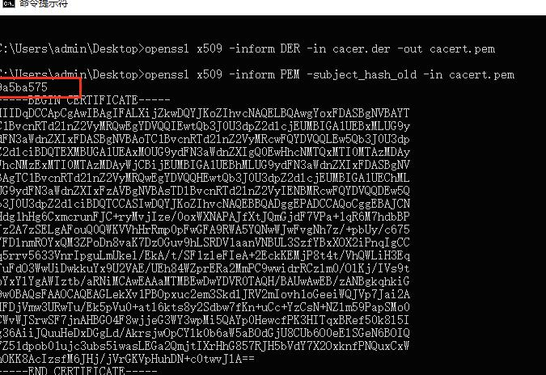

[apk 签名文件公钥私钥是什么？](https://app.applebyme.cn/cloud/appshangjia/9267.html)

APK签名是一种用于验证Android应用程序完整性和来源的机制。在发布应用程序之前，开发人员需要对应用进行签名，并将签名文件与应用一起提交到应用商店或发布渠道。在用户安装应用时，Android系统会验证应用的签名，以确保应用没有被篡改或被未知来源的开发人员签名。

APK签名文件包含公钥和私钥。公钥是用于验证签名的关键，而私钥

则是用于生成和验证签名的密钥。下面将详细介绍APK签名文件的原理和各个组成部分。

\1. 公钥和私钥的生成和匹配：

在生成APK签名文件之前，开发人员需要生成公钥和私钥。公钥是通过私钥生成的，这种关系是非对称[一句话心情签名安卓版](https://tool.yimenapp.com/anzhuo-qianming-2966.html)的。私钥是保密的，并且只有开发人员可以访问。公钥则可以公开使用。

\2. 证书和别名：

生成公钥和私钥后，开发人员需要创建一个证书，以便将公钥和其他应用信息相关联。证书包含开发人员的身份信息（如姓名、电子邮件等）以及应用的包名等信息。证书还包含一个别名，用于区分多个证书。

\3. 签名：

开发人员使用私钥对应用进行签名。签名过程是将应用的所有内容计算一个哈希值，并使用私钥对该哈希值进行加密，生成一个签名。签名文件中包含了签名和证书的信息。

\4. 验证：

当用户下载并安装应用时，Android系统会验证应用的签名。验证过程包括检查证书的完整性、检查签名是否为开发人员的公钥所生成，并对应用进行哈希计算以验证完整性。

APK签名文件的目的是确保应用的完整性和来源可信。如果应用的签名文件与安装时的签名不匹配，系统会拒绝安装应用或显示警告信息。这样可以防止恶意开发人员篡改应用或冒充其他开发人员发布应用。

总结：

APK签名文件是用于验证Android应用完整性和来源的重要机制。它包含公钥和私钥，开发人员使用私钥对应用进行签名，而用户在安装应用时使用公钥进行验证。签名文件的生成和匹配、证书和别名、签名过程以及验证过程等是APK签名机制的关键组成部分。通过这种机制，用户可以信任应用的来源，并且可以[获取apk的签名类型](https://tool.yimenapp.com/apk-qianming-3143.html)确保应用没有被篡改或被未知来源的开发人员签名。

签名文件指的是存放在META-INF文件夹中的文件。META-INF 文件夹是 Android 系统中的一种特殊文件夹，它用来存放应用程序的签名信息。在 META-INF 文件夹中可以找到三种常见的文件：CERT.RSA、CERT.SF和MANIFEST.MF，META-INF文件夹示例见图5。CERT.RSA、CERT.SF这两个文件用来存放应用程序的签名信息。当安装一个应用程序时，Android 系统会检查这两个文件，以确保应用程序的完整性和安全性。MANIFEST.MF文件用来存放应用程序的所有文件的清单信息。

当打包应用程序时，这些文件会自动生成，并且会被打包进 APK 文件中。通常情况下，不需要手动修改这些文件，但是有时候可能需要编辑这些文件来更新应用程序的版本号或者修改权限要求。

META-INF文件夹，用于存放签名证书，在APK安装时作为校验的凭据，用于保护APK不被恶意篡改，同时也是对APK著作权和所有权的声名。例如，对安装包的任意文件最作修改，导致安卓系统检查计算后的签名信息与APK文件中存储的签名信息不一致，最终无法安装，会出现签名冲突的问题。
