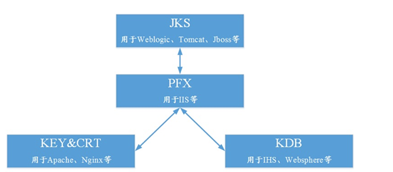

[数字证书格式详解](https://blog.csdn.net/qq_30326609/article/details/128630764)

x509（基本格式）
基本的证书格式，只包含公钥。x509证书由用户公共密钥和用户标识符组成。此外还包括版本号、证书序列号、CA标识符、签名算法标识、签发者名称、证书有效期等信息。

PKCS#7（数字信封）
Public Key Cryptography Standards #7。PKCS#7一般把证书分成两个文件，一个公钥、一个私钥，有PEM和DER两种编码方式。PEM比较多见，是纯文本的，一般用于分发公钥，看到的是一串可见的字符串，通常以.crt，.cer，.key为文件后缀。DER是二进制编码。PKCS#7一般主要用来做数字信封。

PKCS#10
证书请求语法。

PKCS#12（p12或pfx）
Public Key Cryptography Standards #12。一种文件打包格式，为存储和发布用户和服务器私钥、公钥和证书指定了一个可移植的格式，是一种二进制格式，通常以.pfx或.p12为文件后缀名。
使用OpenSSL的pkcs12命令可以创建、解析和读取这些文件。P12是把证书压成一个文件，xxx.pfx 。主要是考虑分发证书，私钥是要绝对保密的，不能随便以文本方式散播。所以P7格式不适合分发。

.pfx文件可以被加密或者签名的，要想读取此文件可能需要解密。

PKCS系列标准
实际上PKCS#7、PKCS#10、PKCS#12都是PKCS系列标准的一部分。相互之间并不是替代的关系，而是对不同使用场景的定义。

证书编码格式
PEM和DER两种编码格式。

PEM（可读）
内容为Base64编码的ASCII码文件，有类似"-----BEGIN CERTIFICATE-----" 和 "-----END CERTIFICATE-----"的头尾标记。

查看PEM格式证书的信息：openssl x509 -in certificate.pem -text -nooutApache和*NIX服务器偏向于使用这种编码格式。

DER（不可读）
证书中没有私钥，DER 编码二进制格式的证书文件。
查看DER格式证书的信息：openssl x509 -in certificate.der -inform der -text -nooutJava和Windows服务器偏向于使用这种编码格式。

各种后缀含义
文件的内容和后缀没有必然的关系，但是一般使用这些后缀来表示这是什么文件。

JKS
Java Key Store(JKS)。

CSR
证书请求文件(Certificate Signing Request)。这个并不是证书，而是向权威证书颁发机构获得签名证书的申请，其核心内容是一个公钥(当然还附带了一些别的个人信息)。
查看的办法：openssl req -noout -text -in my.csr，DER格式的话加上-inform der。

CER
一般指使用DER格式的证书。

CRT
证书文件。可以是PEM格式。

KEY
通常用来存放一个公钥或者私钥。查看KEY的办法：openssl rsa -in mykey.key -text -noout如果是DER格式的话，同理应该这样了：openssl rsa -in mykey.key -text -noout -inform der这是使用RSA算法生成的key这么查看，DSA算法生成的使用dsa参数。

CRL
证书吊销列表 (Certification Revocation List)，是一种包含撤销的证书列表的签名数据结构。

总结
由定义可以看出，只有pfx格式的数字证书是包含有私钥的，cer格式的数字证书里面只有公钥没有私钥，并且证书的编码可以有多种

[证书的几种格式](https://www.dandelioncloud.cn/article/details/1353765347383586818)

一般来说，主流的Web服务软件，通常都基于两种基础密码库：OpenSSL和Java。

Tomcat、Weblogic、JBoss等，使用Java提供的密码库。通过Java的Keytool工具，生成Java Keystore（JKS）格式的证书文件。

Apache、Nginx等，使用OpenSSL提供的密码库，生成PEM、KEY、CRT等格式的证书文件。

此外，IBM的产品，如Websphere、IBM Http Server（IHS）等，使用IBM产品自带的iKeyman工具，生成KDB格式的证书文件。微软Windows Server中的Internet Information Services（IIS），使用Windows自带的证书库生成PFX格式的证书文件。

# 数字证书常见标准

- 符合PKI ITU-T X509标准，传统标准（.DER .PEM .CER .CRT）
- PKCS#7 Cryptographic Message Syntax Standard 加密消息语法标准(.P7B .P7C .SPC .P7R)
- PKCS#10 Certification Request Standard 证书请求标准(.p10)
- PKCS#12 Personal Information Exchange Syntax Standard 个人信息交换标准（.pfx *.p12）
- X509是数字证书的基本规范，而P7和P12则是两个实现规范，P7用于数字信封，P12则是带有私钥的证书实现规范。

X.509 DER 编码(ASCII)的后缀是： .DER .CER .CRT
X.509 PAM 编码(Base64)的后缀是： .PEM .CER .CRT
.cer/.crt是用于存放证书，它是2进制形式存放的，不含私钥。
.pem跟crt/cer的区别是它以Ascii来表示。
pfx/p12用于存放个人证书/私钥，他通常包含保护密码，2进制方式
p10是证书请求
p7r是CA对证书请求的回复，只用于导入
p7b以树状展示证书链(certificate chain)，同时也支持单个证书，不含私钥。
—————-
注：
der,cer文件一般是二进制格式的，只放证书，不含私钥
crt文件可能是二进制的，也可能是文本格式的，应该以文本格式居多，功能同der/cer
pem文件一般是文本格式的，可以放证书或者私钥，或者两者都有
pem如果只含私钥的话，一般用.key扩展名，而且可以有密码保护
pfx,p12文件是二进制格式，同时含私钥和证书，通常有保护密码
怎么判断是文本格式还是二进制？用记事本打开，如果是规则的数字字母，如
—–BEGIN CERTIFICATE—–
MIIE9jCCA96gAwIBAgIQVXD9d9wgivhJM//a3VIcDjANBgkqhkiG9w0BAQUFADBy
—–END CERTIFICATE—–
就是文本的，上面的BEGIN CERTIFICATE，说明这是一个证书
如果是—–BEGIN RSA PRIVATE KEY—–，说明这是一个私钥
文本格式的私钥，也可能有密码保护

DER证书：文件后缀名.der,它和CER证书的不同在于编码格式的不同。

PFX证书/P12证书：它们是一种公钥加密标准#12（PKCS#12）证书，它可以包含公钥、私钥和证书。它是一种加密文件。你可以把它们理解成一个仓库，仓库里面放了公钥、私钥和证书，但是这个仓库是个上了锁的。你要想查看证书，必须先有这个仓库的钥匙才能打开这个仓库。

JKS证书：它是一种Java Key Store文件，主要是针对于Java API操作的一种文件。它和P12文件一样，也是一种加密文件。可以理解成“KEY+CRT文件格式”。

上面几种证书的特点：

*.DER *.CER:这种证书文件是二进制格式的，只含有证书文件和公钥。

*.CRT:这种证书文件可以是二进制格式的，也可以是文本格式的，功能和*.DER *.CER相同。

*.PEM :可以放证书、私钥和公钥。

*.PFX *.P12 是二进制格式，同时含证书和私钥，一般有密码保护。

这几种证书可以相互转换

以下提供了一些证书之间的转换方法：

1. 将JKS转换成PFX

可以使用Keytool工具，将JKS格式转换为PFX格式。

keytool -importkeystore -srckeystore D:\server.jks -destkeystore D:\server.pfx -srcstoretype JKS -deststoretype PKCS12

1. 将PFX转换为JKS

可以使用Keytool工具，将PFX格式转换为JKS格式。

keytool -importkeystore -srckeystore D:\server.pfx -destkeystore D:\server.jks -srcstoretype PKCS12 -deststoretype JKS

1. 将PEM/KEY/CRT转换为PFX

使用OpenSSL工具，可以将密钥文件KEY和公钥文件CRT转化为PFX文件。

将密钥文件KEY和公钥文件CRT放到OpenSSL目录下，打开OpenSSL执行以下命令：

openssl pkcs12 -export -out server.pfx -inkey server.key -in server.crt

1. 将PFX转换为PEM/KEY/CRT

使用OpenSSL工具，可以将PFX文件转化为密钥文件KEY和公钥文件CRT。

将PFX文件放到OpenSSL目录下，打开OpenSSL执行以下命令：

openssl pkcs12 -in server.pfx -nodes -out server.pem

openssl rsa -in server.pem -out server.key

[什么是PKI 体系](https://www.dandelioncloud.cn/article/details/1612453404137979906)

