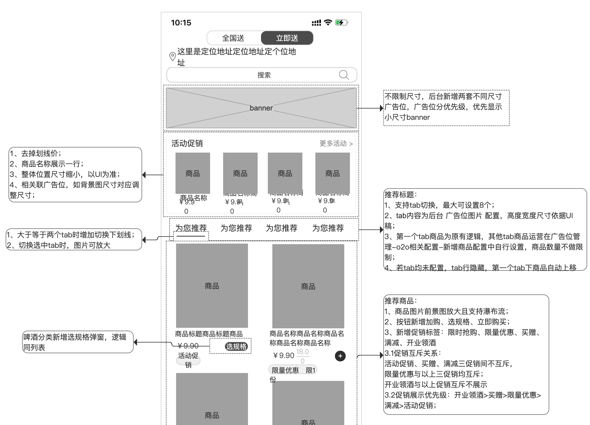
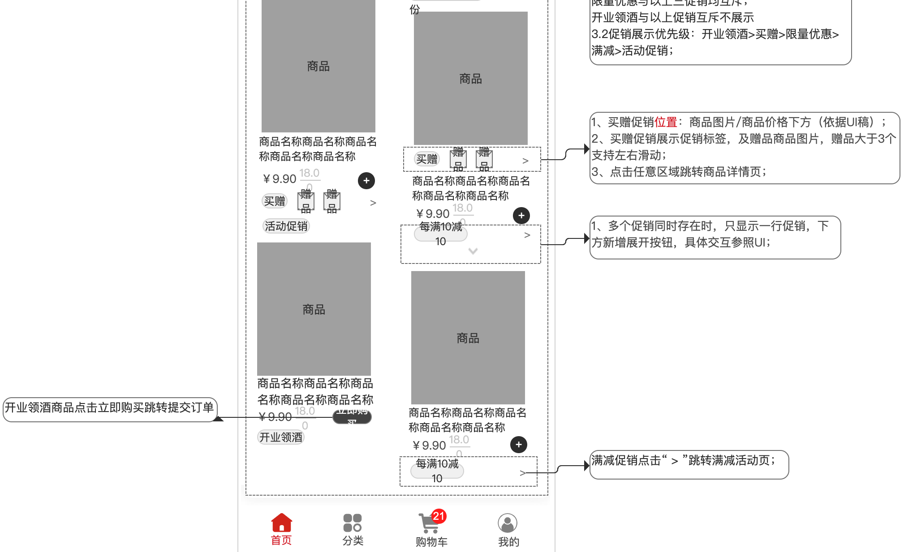

<center><big><b> 立即送首页改版 </b></big></center>


------


[TOC]


#### [页面结构及图片地址]()


```
(用于快速定位要改的文件)，用别名的方式，直接定位并复制到该处


页面层次结构
MainActivity
    SimpleTextFragment{455ba1e} (f246197e-2031-450b-91fc-f973d4ee7160) id=0x7f0a1671}
    MainCartFragment{cf4c715} (57f6c96b-ed3e-4b84-838c-483d107851dd) id=0x7f0a1671}
    MainCommunityFragment{78955b8} (1e67c9b9-4d19-4ead-b153-3903d2464480) id=0x7f0a1671}
          MainHomeFragmentNew{a37c3cd} (9ffd37dc-fa77-4752-96a2-813585aac18c) f0}
          MainHomeFragment{f5523d0} (a112e1dd-640d-44a7-9993-24a17a0bd477) f0}
          B2CShopMainFragment{cd69f85} (1d5fc78a-b200-4f89-9e63-b9c9d88c346f) f1}
    MainMineClubFragment{ce6af01} (d3dbb5a5-955f-47d3-b9fb-a88b5095d4f5) id=0x7f0a1671}


页面层次结构
MainActivity
    MainCartFragment{45c980b} (df0c0880-6776-49fa-a515-3fddfb00e63b id=0x7f091631)
    MainCommunityFragment{57bca5e} (252181ed-d8a5-4052-9d4a-ae7069eb9bc8 id=0x7f091631)
    SimpleTextFragment{24ebc3d} (a0826e80-e1d6-47ea-94ed-27c2777d2df1 id=0x7f091631)
    MainMineClubFragment{4b50b00} (facfc916-4026-485f-9be8-c857e7f33e3c id=0x7f091631)
    MainFragmentTab{e18eedf} (557f6ce5-ebf2-47ee-8171-40db5672c0bf id=0x7f091631)
    
          B2CShopMainFragment{2e635f5} (a86b4681-b2ad-41da-8ec5-d0b95405183c tag=f1)
          MainHomeFragmentNew{c093a18} (c65c0a18-fd0d-429d-b816-3389dd66ee5c tag=f0)
                MainHomeFragment{debdad7} (39c3855c-c552-46af-9e1f-89ac134a258f tag=f0)
    SupportRequestManagerFragment{9aa08a9} (bf8088cb-acd8-4a21-bdf2-53fde8a172a6 tag=com.bumptech.glide.manager){parent=null}


```


### 需求








<video src="立即送首页改版.assets/record_tabLayout_特性.mp4"></video>


### 思路：

请认真核对需求每个界面，及其中的文字描述、并充分理解需求后在开发!


### 接口信息


[接口地址]()


```


```


### UI

[UI地址]()

请认真核对UI每个界面，及其中的文字描述、控件样式特效等。
具体包括每个控件的文字大小，背景颜色及形状，是否加粗，等变化。

【实现开发中需要截图app中的该页面和UI图作对比，找差异】


###### a,1
###### a,2
###### a,3
###### a,4
###### a,5
###### a,6
###### a,7
###### a,8
###### a,


### 文案


```


https://misc.jiuxian.com/image/pintuan-icon.png?2020904
https://misc.jiuxian.com/image/jinbi-icon.png?2020904
https://misc.jiuxian.com/image/yuyue_icon.png?2020904
https://misc.jiuxian.com/image/kfrx_icon.png?2020904
https://misc.jiuxian.com/image/zsrz_icon.png?2020904
https://misc.jiuxian.com/image/zhaopin-icon.png?2020904

"data": [{
			"group": 3,
			"id": 6,
			"imgPath": "https://misc.jiuxian.com/image/pintuan-icon.png?2020904",
			"name": "拼团",
			"sort": 6,
			"type": "INNER_LINK",
			"url": "https://pintuan.jiuxian.com"
		}, {
			"group": 1,
			"id": 1,
			"imgPath": "https://misc.jiuxian.com/image/jinbi-icon.png?2020904",
			"key": "JIN_BI",
			"name": "酒币",
			"sort": 1,
			"type": "NATIVE"
		}, {
			"group": 1,
			"id": 1,
			"imgPath": "https://misc.jiuxian.com/image/yuyue_icon.png?2020904",
			"key": "RESERVATION_KEY",
			"name": "预约",
			"sort": 1,
			"type": "NATIVE"
		}, {
			"group": 1,
			"id": 2,
			"imgPath": "https://misc.jiuxian.com/image/yjfk_icon.png?2020904",
			"key": "FEEDBACK_KEY",
			"name": "意见反馈",
			"sort": 2,
			"type": "NATIVE"
		}, {
			"desc": "官方在线客服",
			"group": 1,
			"id": 3,
			"imgPath": "https://misc.jiuxian.com/image/kfrx_icon.png?2020904",
			"name": "客服热线",
			"sort": 3,
			"tel": "400-617-9999",
			"type": "TEL",
			"xnkfId": "jx_1000_1487130614737"
		}, {
			"group": 2,
			"id": 4,
			"imgPath": "https://misc.jiuxian.com/image/zsrz_icon.png?2020904",
			"name": "线上平台入驻",
			"sort": 4,
			"type": "INNER_LINK",
			"url": "https://shop.jiuxian.com/show/wap/act/viewShopActivity.htm?viewType=2&actId=6171"
		}, {
			"group": 2,
			"id": 5,
			"imgPath": "https://misc.jiuxian.com/image/jczs_logo.png?2020904",
			"name": "线下酒城招商",
			"sort": 5,
			"type": "INNER_LINK",
			"url": "https://b.eqxiu.com/s/CliHaWdQ"
		}, {
			"group": 3,
			"id": 10,
			"imgPath": "https://misc.jiuxian.com/image/zhaopin-icon.png?2020904",
			"name": "招聘",
			"sort": 6,
			"type": "INNER_LINK",
			"url": "https://m.jiuxian.com/mobile/recruit/recruit.html"
			

```


需求或UI中的文本描述 例：
```


```


开发的activity 类名，布局文件名，布局id,属性等，涉及到多个文件的改动，就复制一份出来
```
a1, 类名
打开当前页面的activity或fragment后 按快捷键  【shift+Alt+Command+c】或【shift+Command+c】 复制类名


a2,布局名
打开当前页面的activity或fragment后 按快捷键  【Ctrl+Command+UP】显示和当前界面关联的布局 或android 清单文件
    选中要变更的布局后 按快捷键复制布局名到此处

a3,该布局变更的id或属性


a4,该布局变更的文章描述
      从UI图中获取


a5,新增类、view布局、图片、方法、bean对象起名的记录


```


### 待完成的功能


```


```


### bug改动点


##### a,1
[]()


##### a,2
[]()


##### a,3
[]()


### 提交说明

```

2023-09-25--10-09-11_付玉光_立即送首页改版
feature_fyg_9.1.16_立即送首页改版

写上日期
分支名
提交说明，提交以一个小功能或完整的功能为一个单位进行commit,不然提交记录会变的杂乱无章，不好回顾历史及归档，经量以rebase的方式合并

a,1
a,2
a,3
a,4
a,5
a,6
a,7
a,8
a,9

```


### 知识网，此处只是知识体系的引用目录路径，具体还需要你建立知识体系目录 通过命令 别名mcm或mcs

[]()
[]()

```


```


[TOC]


```

双因素恢复代码
如果您无法访问设备并且无法接收双因素身份验证代码，则可以使用恢复代码来访问您的帐户。

恢复代码
确保您的恢复代码与您的密码一样安全。我们建议使用密码管理器（例如 1Password、 Authy或 Keeper ）保存它们。
将您的恢复代码保存在安全的地方。 如果您丢失密码和第二因素，这些代码是访问您帐户的最后手段。如果您找不到这些代码，您将无法访问您的帐户。

d77a1-9bd76 
1fdba-85ba5 
7b9b2-54041 
4c74e-f3cec 
a69ee-cc18a 
7495b-109ce 
d8f79-fa7a1 
924c9-70e5f 
c17ba-02beb 
ecf25-60a13 
8a540-6f5f7 
5f5e9-92485 
66be9-e697d 
0b027-0c936 
601fb-d6382 
12b9c-4723b


```

