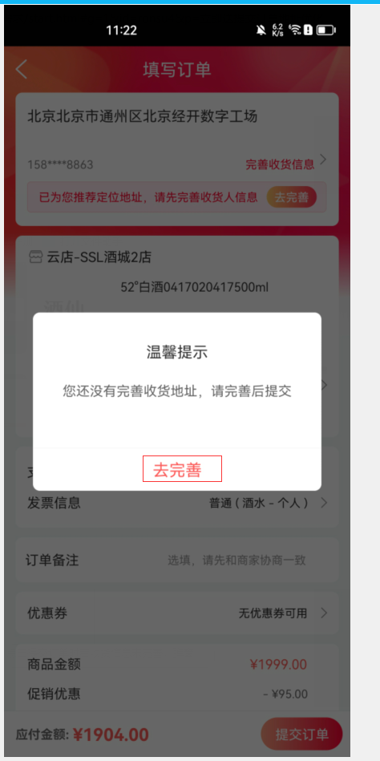
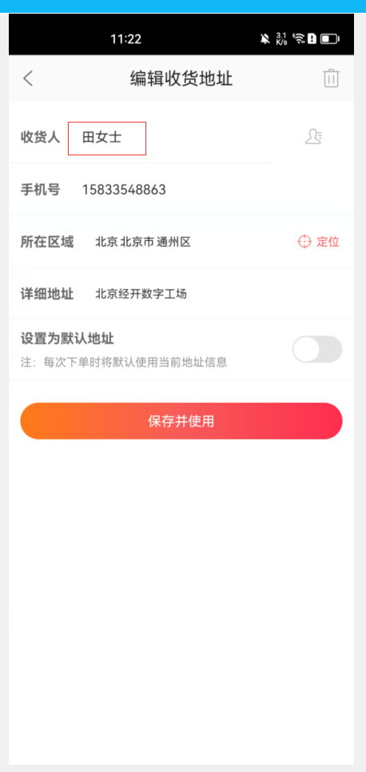

<center><big><b> fix_提交订单去完善地址有两套逻辑_统一成一种&提交订单进地址页不需要带收货人姓名 </b></big></center>


------


[TOC]


#### [页面结构及图片地址]()


```
(用于快速定位要改的文件)，用别名的方式，直接定位并复制到该处

```


### [需求]()


### 思路：
请认真核对需求每个界面，及其中的文字描述、并充分理解需求后在开发!


### 接口信息


[接口地址]()


```


```


### UI


[UI地址]()


请认真核对UI每个界面，及其中的文字描述、控件样式特效等。
具体包括每个控件的文字大小，背景颜色及形状，是否加粗，等变化。

【实现开发中需要截图app中的该页面和UI图作对比，找差异】


###### a,1
###### a,2
###### a,3
###### a,4
###### a,5
###### a,6
###### a,7
###### a,8
###### a,


### 文案


```


fix(OrderCommit2Activity | OrderCommitActivity): 提交订单去完善地址有两套逻辑，统一成一种&提交订单进地址页不需要带收货人姓名


choiceAddress()


/** showAddressEmptyDialog 对话框中的确定按钮   */
    private OnClickListener mSureOnClickListener = new OnClickListener() {
        @Override
        public void onClick(View v) {
            if (mHasIsPlatform) {
                AddressListResultInfo.AddrListItem addressInfo = JZKUserDataHelper.getLocation();
                if (addressInfo != null) {
                    addressInfo.mMobile = mOrderPrepareResult.mBindMobil;
                    ActivityCenter.gotoNewAddressEditActivity(mActivity, addressInfo, true, mShopIds);
                }
                return;
            }
            ActivityCenter.gotoNewAddressActivity(mActivity, true, mShopIds);
        }
    };
    
    
    
    
if ((mOrderPrepareResult != null && mOrderPrepareResult.mAddressInfo != null &&
                mOrderPrepareResult.mAddressInfo.mId > 0) || isReservation()) {
            ActivityCenter.gotoChoiceAddressActivity(mActivity, mOrderPrepareResult.mAddressInfo.mCase == 4 ? 0
                    : mOrderPrepareResult.mAddressInfo.mId, mShopIds);
        }
        
        
        

```


需求或UI中的文本描述 例：
```


```


开发的activity 类名，布局文件名，布局id,属性等，涉及到多个文件的改动，就复制一份出来
```
a1, 类名
打开当前页面的activity或fragment后 按快捷键  【shift+Alt+Command+c】或【shift+Command+c】 复制类名


a2,布局名
打开当前页面的activity或fragment后 按快捷键  【Ctrl+Command+UP】显示和当前界面关联的布局 或android 清单文件
    选中要变更的布局后 按快捷键复制布局名到此处

a3,该布局变更的id或属性


a4,该布局变更的文章描述
      从UI图中获取


a5,新增类、view布局、图片、方法、bean对象起名的记录


```


### 待完成的功能


```


```


### bug改动点


##### a,1
[]()






4.android：提交订单页，去完善地址弹框点击【去完善】按钮，进入编辑收货地址页时，收货人

显示了上一次保存的收货人，应该显示空


##### a,2
[]()


##### a,3
[]()


### 提交说明

```

1f5e9c4a6 - (HEAD -> feature/feature_preRelease_9.1.17) fix(OrderCommit2Activity | OrderCommitActivity): 
提交订单去完善地址有两套逻辑，统一成一种&提交订单进地址页不需要带收货人姓名 (2023-10-12) <fuyuguang>


2023-10-12--16-14-13_付玉光_fix_提交订单去完善地址有两套逻辑_统一成一种&提交订单进地址页不需要带收货人姓名
feature_fyg_9.1.17_fix_提交订单去完善地址有两套逻辑_统一成一种&提交订单进地址页不需要带收货人姓名

写上日期
分支名
提交说明，提交以一个小功能或完整的功能为一个单位进行commit,不然提交记录会变的杂乱无章，不好回顾历史及归档，经量以rebase的方式合并

a,1
a,2
a,3
a,4
a,5
a,6
a,7
a,8
a,9

```


### 知识网，此处只是知识体系的引用目录路径，具体还需要你建立知识体系目录 通过命令 别名mcm或mcs
[]()
[]()
[]()
[]()
[图片或视频路径]()


```


```


[TOC]


```
2023-10-12--16-14-13_付玉光_fix_提交订单去完善地址有两套逻辑_统一成一种&提交订单进地址页不需要带收货人姓名
feature/feature_fyg_9.1.17_fix_提交订单去完善地址有两套逻辑_统一成一种&提交订单进地址页不需要带收货人姓名
```


### 酒仙官网app android9.1.17版本【fix_提交订单去完善地址有两套逻辑_统一成一种&提交订单进地址页不需要带收货人姓名】功能提测


| 提测需求/bug  |   描述          |  开发           |  产品                |       完成      |  编号            |  变更影响范围     |   自测    |  提测分支       |  提测时间         |
| ------------ |      ----      |       ----     |      ----            |      ----      |  ----            |   ------------  |   ----   |  ------       |  --------        |
|  fix_提交订单去完善地址有两套逻辑_统一成一种&提交订单进地址页不需要带收货人姓名   |                |  付玉光       |   付玉光    |       ok       | 2023-10-12/16-14-13  |                 |    ok    | feature/feature_preRelease_9.1.17 |  2023-10-12/16:17:57 |


```
2023-10-12--16-14-13_付玉光_fix_提交订单去完善地址有两套逻辑_统一成一种&提交订单进地址页不需要带收货人姓名
feature/feature_fyg_9.1.17_fix_提交订单去完善地址有两套逻辑_统一成一种&提交订单进地址页不需要带收货人姓名
```


### 酒仙官网app android9.1.17版本【fix_提交订单去完善地址有两套逻辑_统一成一种&提交订单进地址页不需要带收货人姓名】功能提测


| 提测需求/bug  |   描述          |  开发           |  产品                |       完成      |  编号            |  变更影响范围     |   自测    |  提测分支       |  提测时间         |
| ------------ |      ----      |       ----     |      ----            |      ----      |  ----            |   ------------  |   ----   |  ------       |  --------        |
|  fix_提交订单去完善地址有两套逻辑_统一成一种&提交订单进地址页不需要带收货人姓名   |                |  付玉光       |   付玉光    |       ok       | 2023-10-12/16-14-13  |                 |    ok    | feature/feature_preRelease_9.1.17 |  2023-10-12/17:55:59 |


```
2023-10-12--16-14-13_付玉光_fix_提交订单去完善地址有两套逻辑_统一成一种&提交订单进地址页不需要带收货人姓名
feature/feature_fyg_9.1.17_fix_提交订单去完善地址有两套逻辑_统一成一种&提交订单进地址页不需要带收货人姓名
```


### 酒仙官网app android9.1.17版本【fix_提交订单去完善地址有两套逻辑_统一成一种&提交订单进地址页不需要带收货人姓名】功能提测


| 提测需求/bug  |   描述          |  开发           |  产品                |       完成      |  编号            |  变更影响范围     |   自测    |  提测分支       |  提测时间         |
| ------------ |      ----      |       ----     |      ----            |      ----      |  ----            |   ------------  |   ----   |  ------       |  --------        |
|  fix_提交订单去完善地址有两套逻辑_统一成一种&提交订单进地址页不需要带收货人姓名   |                |  付玉光       |   付玉光    |       ok       | 2023-10-12/16-14-13  |                 |    ok    | feature/feature_preRelease_9.1.17 |  2023-10-12/18:14:06 |


