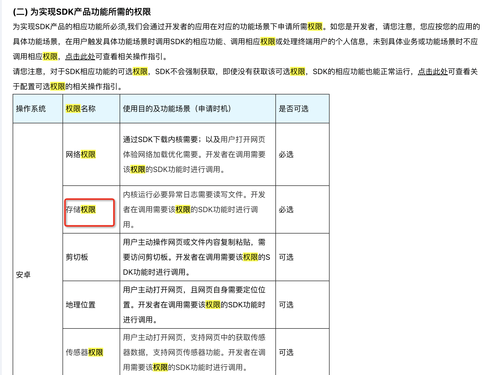
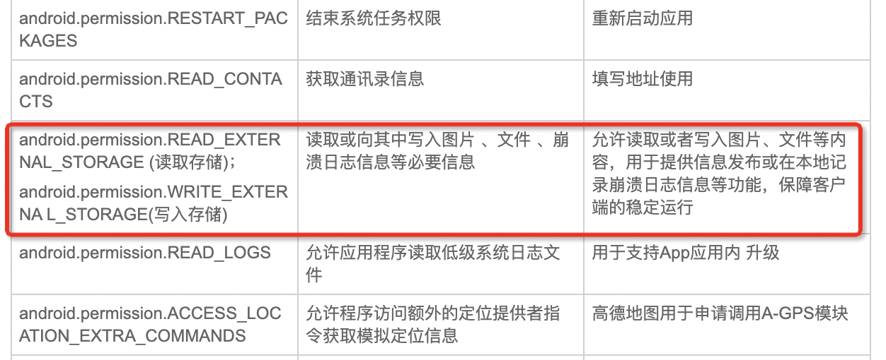

#### 很抱歉，您的应用未通过审核，原因如下：

1、在上架自动化检测环节，识别到APP内「存在隐私违规问题」；具体违规问题的检测报告已生成，您可以前往「开发者站首页-隐私合规」功能模块内，查询和下载检测报告；如您在隐私问题整改过程中需要提供整改指引，可通过「工单反馈」与我们取得联系，我们将安排隐私专员与您对接。


[小米开放平台](https://dev.mi.com/distribute/app/2882303761517135958?namespaceValue=0&userId=104294417&packageName=com.jiuxianapk.ui)


[小米澎湃OS技术白皮书V1.0.pdf](https://cdn-file.hyperos.mi.com/hyperos-file/%E5%B0%8F%E7%B1%B3%E6%BE%8E%E6%B9%83OS%E6%8A%80%E6%9C%AF%E7%99%BD%E7%9A%AE%E4%B9%A6V1.0.pdf)


违规收集个人信息

APP以隐私政策弹窗的形式向用户明示收集使用规则，

但未见清晰明示APP收集SD卡数据等的目的方式范围，用户同意隐私政策后，存在收集SD卡数据的行为。


 APP向用户明示SDK的收集使用规则，但未见清晰明示腾讯SDK获取SD卡数据、腾讯Web浏览器框架,腾讯TBS浏览服务获取SD卡数据等的目的方式范围，用户同意隐私政策后，SDK存在腾讯SDK获取SD卡数据、腾讯Web浏览器框架,腾讯TBS浏览服务获取SD卡数据的行为。


第三方SDK列表

1、腾讯tbsSDK

**使用目的：**  在手机端实现流畅、高性能的浏览体验

**数据类型：** 设备信息（设备型号、操作系统、CPU类型）

**官网链接：https://x5.tencent.com**

**处理方式：** 通过去标识化、加密传输和处理的安全处理方式

**公司名称：** 北京微梦创科网络技术有限公司


[**腾讯浏览服务X5网页引擎SDK个人信息保护规则**](https://rule.tencent.com/rule/1c4e2b4b-d0f6-4a75-a5c6-1cfce00a390d)


[文档中心](https://x5.tencent.com/docs.html?indator=ComplianceGuide)


[**腾讯浏览服务X5网页引擎SDK个人信息保护规则**](https://x5.tencent.com/docs.html?indator=ComplianceGuide)


[**腾讯浏览服务X5网页引擎SDK个人信息保护规则_为实现SDK产品功能所需的权限**](https://x5.tencent.com/docs.html?indator=ComplianceGuide)




酒仙app内部sdk权限提示：

```
PrivacyAgreementOneActivity 页面
```

[应用权限说明](https://m.jiuxian.com/mobile/Agreement/applicationPermission.html)





目前线上配置：


腾讯TBS浏览服务
功能：加载网页页面
收集个人信息字段： Wifi信息、MAC地址、IMSI、bssid、IMEI、设备序列号、android_id
收集方式：SDK本机采集
链接地址：https://x5.tencent.com/docs/access.html
所属机构：深圳市腾讯计算机系统有限公司
合作方隐私政策：https://x5.tencent.com/tbs/policy.html


酒仙应用权限申请与使用情况说明中有sdk读写权限的描述说明：

https://m.jiuxian.com/mobile/Agreement/applicationPermission.html


android.permission.READ_EXTERNAL_STORAGE (读取存储)；

android.permission.WRITE_EXTERNA L_STORAGE(写⼊存储)

读取或向其中写⼊图片 、文件 、崩溃日志信息等必要信息

允许读取或者写⼊图片、文件等内容，用于提供信息发布或在本地记录崩溃日志信息等功能，保障客户端的稳定运⾏


[**腾讯浏览服务X5网页引擎SDK个人信息保护规则_为实现SDK产品功能所需的权限**](https://x5.tencent.com/docs.html?indator=ComplianceGuide)

https://x5.tencent.com/docs.html?indator=ComplianceGuide

以下内容来自该文档中的内容


> 2、配置可选权限

请您注意，SDK不强制获取可选权限，即使没有获取可选权限，SDK提供的基本功能也能正常运行。您可以配置可选权限，以便使用SDK提供的其他可选功能。建议调用请求前在合适的时机调用SDK提供的方法，在用户授权的情况下获取声明中的权限。

https://st.tencent-cloud.com/jax-static/TBS-WebIndex/1001/info.png

