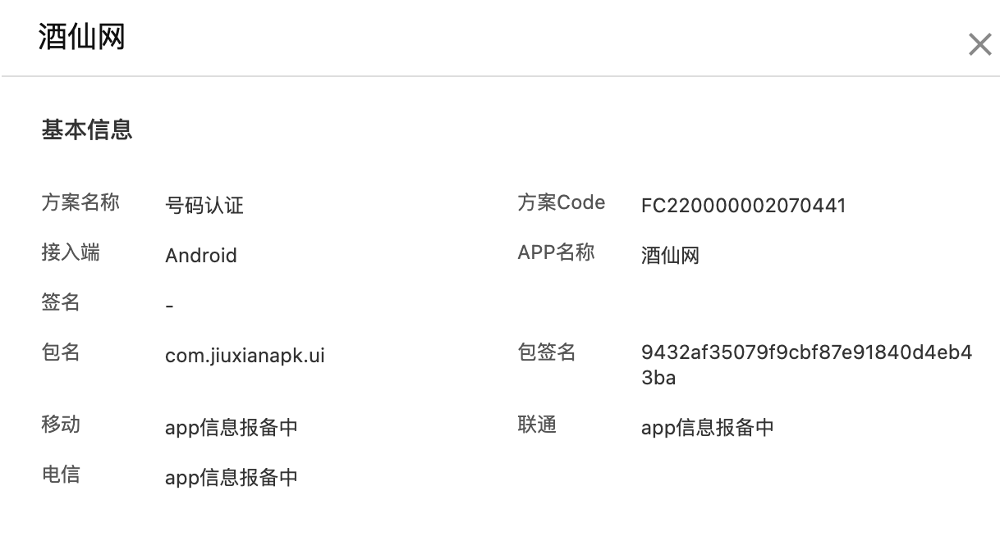

<center><big><b> 号码认证服务标准版本升级公告 </b></big></center>


------


update 问题原因：
娜迦加固，360加固等壳上使用了ptrace检测，我们SDK也用了ptrace反调试，双方的方案不同，娜迦加固可能使用占用端口反调试，这样使我们的ptrace检测端口为0的反调试检测出正在被调试。
解决方案：
采用白名单策略 用户对密钥进行md5加密 用这个值作为文件名 存入app的assets目录 sdk检测通过就不再进行ptrace检测

“控制台上的密钥”MD5加密（32位，小写）， 用这个值作为一个文件名，存入app的assets目录么。（在这个目录下新建一个文件，加密后的值作为文件名）


[TOC]


[关于号码认证标准版本升级公告_号码认证服务(PNVS)-阿里云帮助中心](https://help.aliyun.com/zh/pnvs/product-overview/upgrade-phone-number-verification-service-sdk-standard-edition?spm=5176.11662647.0.0.2e8254b8LZ5h9T)

[号码认证服务](https://dypns.console.aliyun.com/sdkservice?spm=a2c4g.11186623.0.0.38b1510fww4HH1)


OneKeyLoginUtil.java


 

 ** 老sdk版本号 **


phoneNumber-L-AuthSDK-2.12.1.4:@aar


配置认证页

CustomXmlConfig.java

custom_full_port.xml


```

{"carrierFailedResultData":"","code":"600001","msg":"唤起授权页成功","requestCode":0,"requestId":"ddf0ce3a-9051-4e37-aaee-011a70d89f53","vendorName":"cm_zyhl"}


```


SDK下载（含demo）

SDK名称	号码认证

开发者	阿里巴巴云计算有限公司

SDK版本	2.13.3

SDK包名	numberAuthSDK_APP_Android_v2.13.3_operator_ui_log_static

SDK更新时间	2024-01-31

SDK大小	19.18Mb

SDK MD5值	bb0ce2feb681314663fb0a38dcbf6ee1

隐私政策	[点击查看](https://help.aliyun.com/zh/pnvs/user-guide/number-certification-service-compliance-guidelines)


升级前链接

[号码认证服务](https://dypns.console.aliyun.com/overview?spm=a2c4g.11186623.0.0.4f133b81Psvk6X&accounttraceid=c8a1886dc0644f3bbfa0244e6b117835gicx)


# android 

##### 方案Code

FC100000157774039


之前的秘钥：

```

mcssGdibKKHvEG1eTQzNZdlqhrx/zs30I/m6QfjCicfVxYpNi1T4Dz4HJrEoAZEPxVq5Kgd5DvMd9sbSOiZPW+gnpIRph99NdgfyLIjBQIOyp+ttqhPgZV9JpcDUzYm04LM1gB2wHyP85PHRi64oTX4EszlVDC4OObsXy4xbfWoTPE/sxD4w0vPwiyYgCNwcMbj/BhdOlIkH/TcTlMjKPhOL6LqDLps7THITmDxHgAFwB6uRcC+j22/Y6sM9zVCf8PEpYL9oSHiPZ4sXPgCaOjXR380wt1caoasD3T1CpBNtubjJshn7pg==


mcssGdibKKHvEG1eTQzNZdlqhrx/zs30I/m6QfjCicfVxYpNi1T4Dz4HJrEoAZEPxVq5Kgd5DvMd9sbSOiZPW+gnpIRph99NdgfyLIjBQIOyp+ttqhPgZV9JpcDUzYm04LM1gB2wHyP85PHRi64oTX4EszlVDC4OObsXy4xbfWoTPE/sxD4w0vPwiyYgCNwcMbj/BhdOlIkH/TcTlMjKPhOL6LqDLps7THITmDxHgAFwB6uRcC+j22/Y6sM9zVCf8PEpYL9oSHiPZ4sXPgCaOjXR380wt1caoasD3T1CpBNtubjJshn7pg==


```


升级后信息：





新秘钥

```

q5KuWt50/mrLDaKDHyin85mAlc9lzvH4xFsg5s33UJBsBEFsANBTEXKfcf264AkvQhec+mtrFJYEIrqXA2CPqic8/x/lLyP2sm3WIh4/+tpyhH1OzpEa2mQTrfzuHz1zfaz6koo4PGtTF4Lhzbz8cHEuSyAuyGFoYSc14iQGrI0zfP+BX/OGVPETzVtrgEwWmwnsTpW4KwMXkqwND4K70pOJ7m1Dc7IFKwdWrg3qWTwXM0mE+LxSwgXJ90f2fC677SLqx60R/H+SXF/IkPuopRiJZvw9GPrLGXolLBBTGitbicZ7H8cweQ==


```


[号码认证服务_sdk下载页面](https://dypns.console.aliyun.com/sdkservice?spm=a2c4g.11186623.0.0.2876510f8gYiMb)


##### iOS

##### 方案Code

FC100000157794038


##### 密钥

```

hmKCZVoESM2efFlMmujsee4yIYJWlu3IQWBDumSIBG38NMV1fAbl5aBjO9L4JkXCTg3KuAgiOK7qsDY1Lz0OVW+28I5l8RTOzIkbABWic8XzAhg+z93e64C6iMgkBbJJe441rTUp2Ruqn/kUzj/za+1LQBgoRBWlSWFfrVIeESaSWrfkUMD1G+ctQnACq9wqTNSoEfwMcMVPxhDp5Pv+jo5MCQ8cySbCr773Q7Cwt4/JdVgK3p8WMvc6dC40IQiNCS05S3UISn4=

```

